---
## Front matter
lang: ru-RU
title: Лабораторная работа 14
## subtitle: Простейший шаблон
author:
  - Тагиев Б. А.
institute:
  - Российский университет дружбы народов, Москва, Россия
date: 8 июня 2023

## i18n babel
babel-lang: russian
babel-otherlangs: english

## Formatting pdf
toc: false
toc-title: Содержание
slide_level: 2
aspectratio: 169
section-titles: true
theme: metropolis
mainfont: DejaVu Serif
romanfont: DejaVu Serif
sansfont: DejaVu Sans
monofont: DejaVu Sans Mono
header-includes:
 - \metroset{progressbar=frametitle,sectionpage=progressbar,numbering=fraction}
 - '\makeatletter'
 - '\beamer@ignorenonframefalse'
 - '\makeatother'
---

## Цель работы

Смоделировать "модель" обработки заказов.

## Выполнение работы

1. В интернет-магазине заказы принимает один оператор. Интервалы поступления заказов распределены равномерно с интервалом 15 ± 4 мин. Время оформления заказа также распределено равномерно на интервале 10 ± 2 мин. Обработка поступивших заказов происходит в порядке очереди (FIFO). Требуется разработать модель обработки заказов в течение 8 часов.

## Выполнение работы

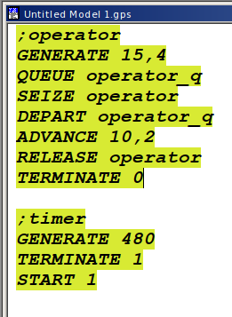{width=30%}

## Выполнение работы

2. Сформулируем отчет по модели.

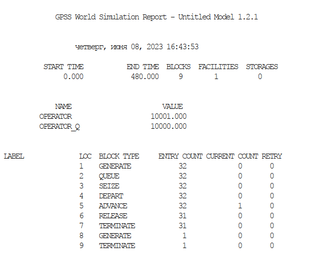{width=50%}

## Выполнение работы

3. Скорректируйте модель в соответствии с изменениями входных данных: интервалы поступления заказов распределены равномерно с интервалом 3.14 ± 1.7 мин; время оформления заказа также распределено равномерно на интервале 6.66 ± 1.7 мин.

## Выполнение работы

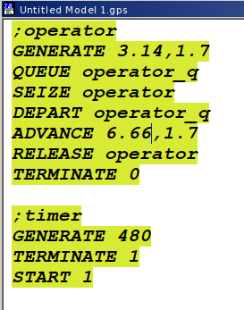{width=30%}

## Выполнение работы

4. Сформулируем отчет. Наблюдаем то, что появилась очередь и 1 человек еще обрабатывается.

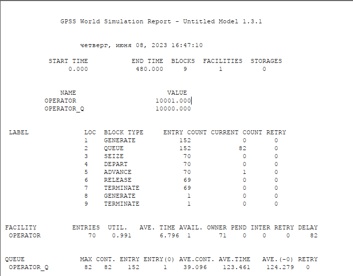{width=50%}

## Выполнение работы

5. Построим гистограмму при помощи следующего кода (опечатка 3.34 => 3.14)

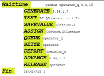{width=50%}

## Выполнение работы

6. И получим гистограмму вхождения заявок в очередь. И в отчете мы получим нашу таблицу, по которой строится гистограмма. 2 все еще в очереди, а 1 обрабатывается. Среднее время обслуживания заявок от 8 до 14, большинство заявок было обработано от 10 до 12.

## Выполнение работы

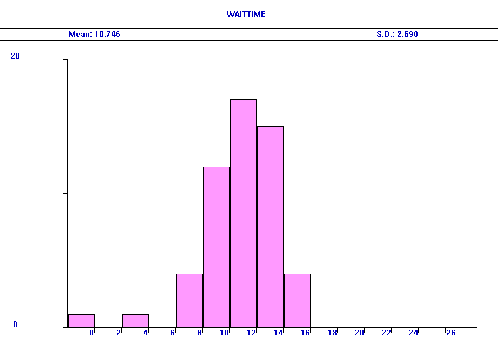{width=50%}

## Выполнение работы

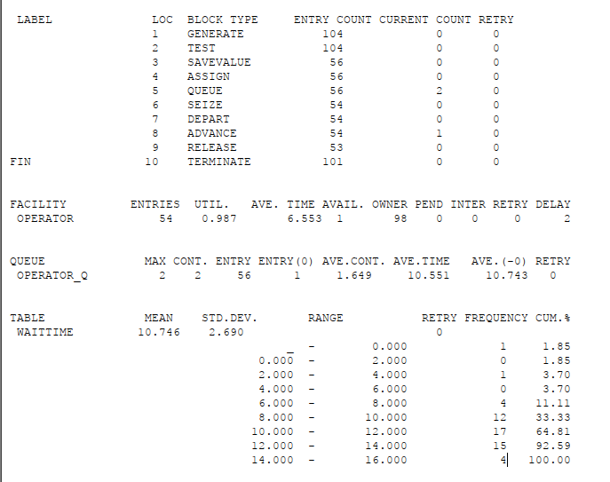{width=50%}

## Выполнение работы

7. Построим модель с обработкой двух типов заказов. Здесь у нас имеется основная услуга и еще дополнительный пакет услуг.

## Выполнение работы

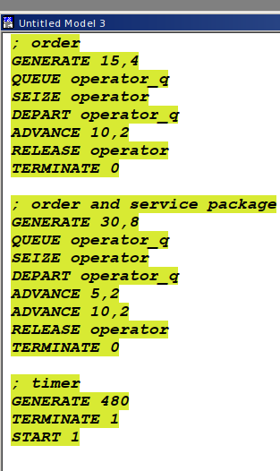{width=30%}

## Выполнение работы

8. Сформулируем отчет. Наблюдаем то, что 32 обычных заказов и 15 из них с доп. пакетом. Для первого типа 4 в очереди, 1 в обработке. Для второго типа 3 еще в очереди.

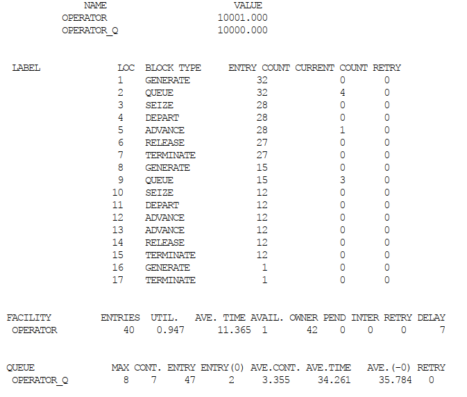{width=30%}

## Выполнение работы

9. Скоректируем модель так, чтобы учитывалось условие, что число заказов с дополнительным пакетом услуг составляет 30% от общего числа заказов.

## Выполнение работы

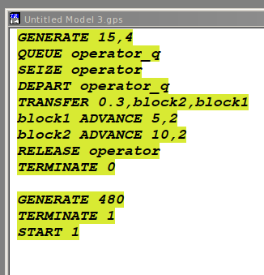{width=30%}

## Выполнение работы

10. Сформируем отчет. Видим, что 32 заказа создано, из них 6 с доп обслуживанием.

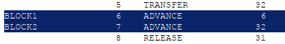{width=50%}

## Выполнение работы

11. Перейдем к моделированию оформления заказов несколькими операторами. Код дан в самой лабораторной работе, потому перейдем к отчетам. По заданию нужно было добавить условие, что при наличии более двух заявок клиент отказывается от обслуживания. Делается это при помощи `TEST`.

## Выполнение работы

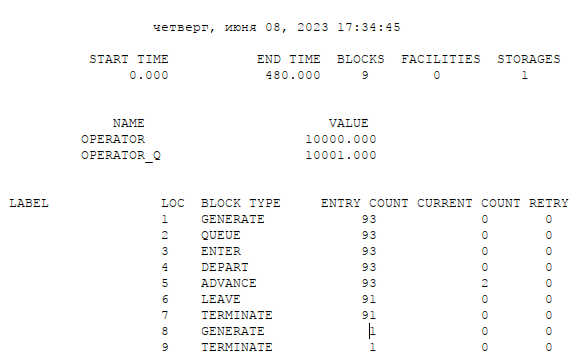{width=50%}

## Выполнение работы

12. В отчетах нет никакой разницы, так как максимальное значение очереди без `TEST` было один.

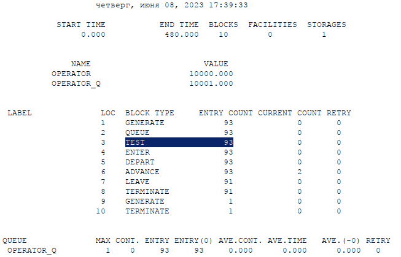{width=50%}

## Выводы

Я смоделировал обработку заказов на GPSS.
