---
## Front matter
title: "Лабораторная работа 14"
##subtitle: "Простейший вариант"
author: "Тагиев Байрам Алтай оглы"

## Generic otions
lang: ru-RU
toc-title: "Содержание"

## Pdf output format
toc: true # Table of contents
toc-depth: 2
lof: true # List of figures
lot: true # List of tables
fontsize: 12pt
linestretch: 1.5
papersize: a4
documentclass: scrreprt
## I18n polyglossia
polyglossia-lang:
  name: russian
  options:
	- spelling=modern
	- babelshorthands=true
polyglossia-otherlangs:
  name: english
## I18n babel
babel-lang: russian
babel-otherlangs: english
## Fonts
mainfont: DejaVu Serif
romanfont: DejaVu Serif
sansfont: DejaVu Sans
monofont: DejaVu Sans Mono
mainfontoptions: Ligatures=TeX
romanfontoptions: Ligatures=TeX
sansfontoptions: Ligatures=TeX,Scale=MatchLowercase
monofontoptions: Scale=MatchLowercase,Scale=0.9
## Pandoc-crossref LaTeX customization
figureTitle: "Рис."
tableTitle: "Таблица"
listingTitle: "Листинг"
lofTitle: "Список иллюстраций"
lotTitle: "Список таблиц"
lolTitle: "Листинги"
## Misc options
indent: true
header-includes:
  - \usepackage{indentfirst}
  - \usepackage{float} # keep figures where there are in the text
  - \floatplacement{figure}{H} # keep figures where there are in the text 
  - \usepackage{pdflscape}
  - \newcommand{\blandscape}{\begin{landscape}}
  - \newcommand{\elandscape}{\end{landscape}}
---

# Цель работы

Смоделировать "модель" обработки заказов. 

# Выполнение работы

1. В интернет-магазине заказы принимает один оператор. Интервалы поступления заказов распределены равномерно с интервалом 15 ± 4 мин. Время оформления заказа также распределено равномерно на интервале 10 ± 2 мин. Обработка поступивших заказов происходит в порядке очереди (FIFO). Требуется разработать модель обработки заказов в течение 8 часов.

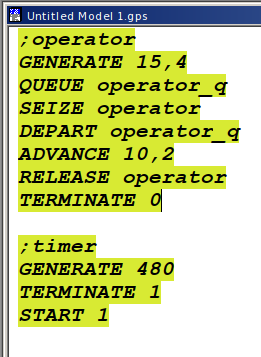{width=50%}

2. Сформулируем отчет по модели.

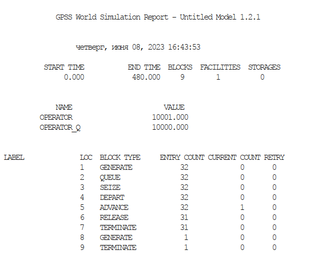{width=50%}

3. Скорректируйте модель в соответствии с изменениями входных данных: интервалы поступления заказов распределены равномерно с интервалом 3.14 ± 1.7 мин; время оформления заказа также распределено равномерно на интервале 6.66 ± 1.7 мин. 

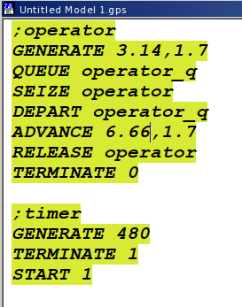{width=50%}

4. Сформулируем отчет. Наблюдаем то, что появилась очередь и 1 человек еще обрабатывается. 

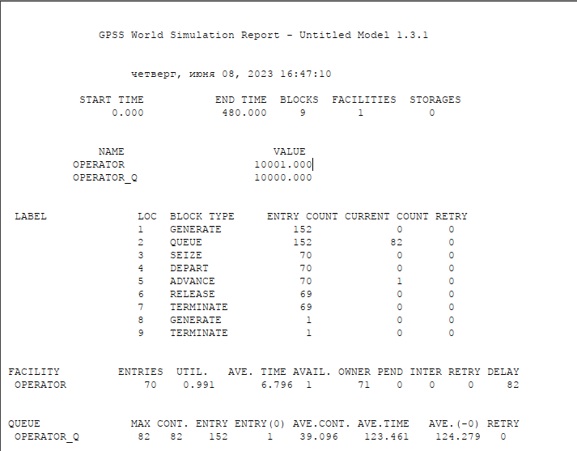{width=50%}

5. Построим гистограмму при помощи следующего кода (опечатка 3.34 => 3.14)

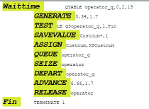{width=50%}

6. И получим гистограмму вхождения заявок в очередь. И в отчете мы получим нашу таблицу, по которой строится гистограмма. 2 все еще в очереди, а 1 обрабатывается. Среднее время обслуживания заявок от 8 до 14, большинство заявок было обработано от 10 до 12.

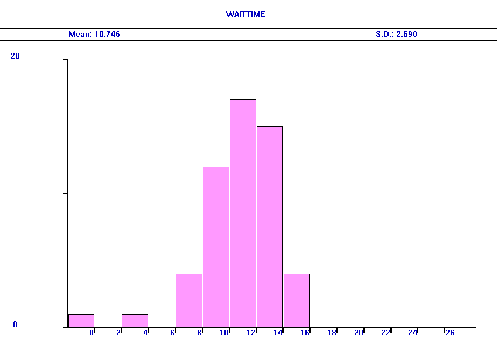{width=50%}

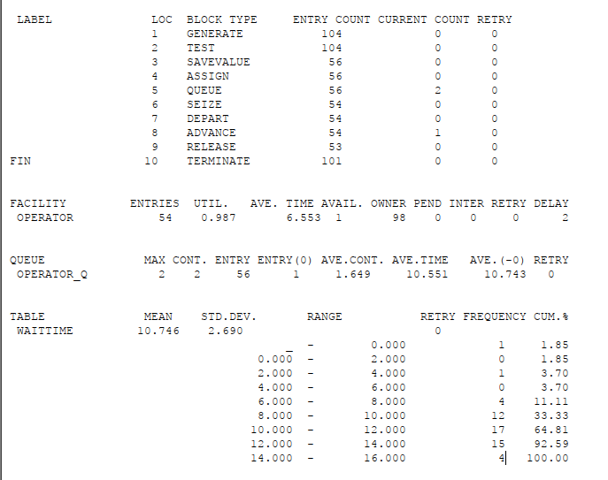{width=50%}

7. Построим модель с обработкой двух типов заказов. Здесь у нас имеется основная услуга и еще дополнительный пакет услуг.

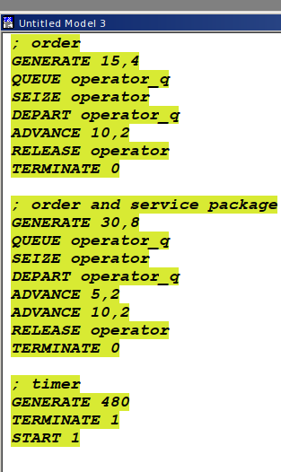{width=50%}

8. Сформулируем отчет. Наблюдаем то, что 32 обычных заказов и 15 из них с доп. пакетом. Для первого типа 4 в очереди, 1 в обработке. Для второго типа 3 еще в очереди.

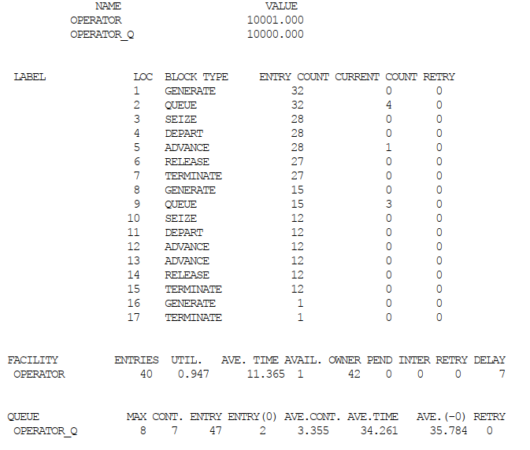{width=50%}

9. Скоректируем модель так, чтобы учитывалось условие, что число заказов с дополнительным пакетом услуг составляет 30% от общего числа заказов.

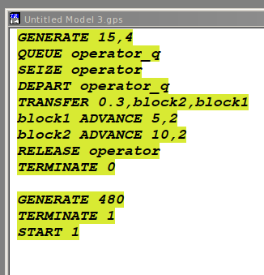{width=50%}

10. Сформируем отчет. Видим, что 32 заказа создано, из них 6 с доп обслуживанием.

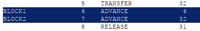{width=50%}

11. Перейдем к моделированию оформления заказов несколькими операторами. Код дан в самой лабораторной работе, потому перейдем к отчетам. По заданию нужно было добавить условие, что при наличии более двух заявок клиент отказывается от обслуживания. Делается это при помощи `TEST`.

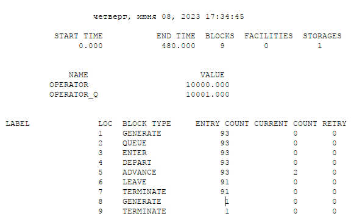{width=50%}

12. В отчетах нет никакой разницы, так как максимальное значение очереди без `TEST` было один.

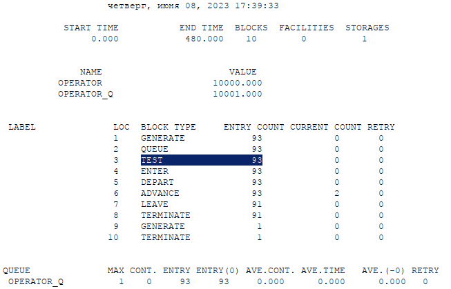{width=50%}

# Выводы

Я смоделировал обработку заказов на GPSS.
