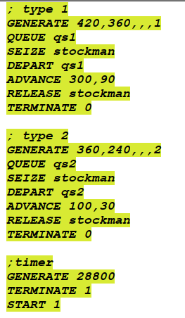
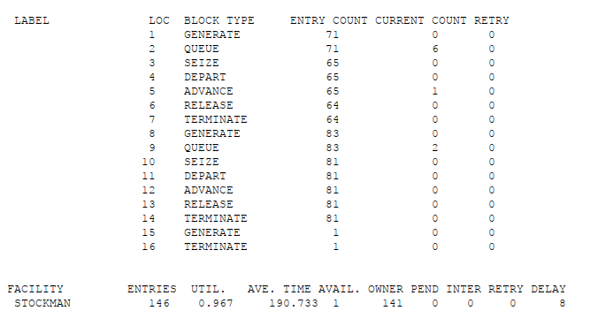
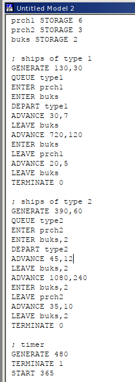
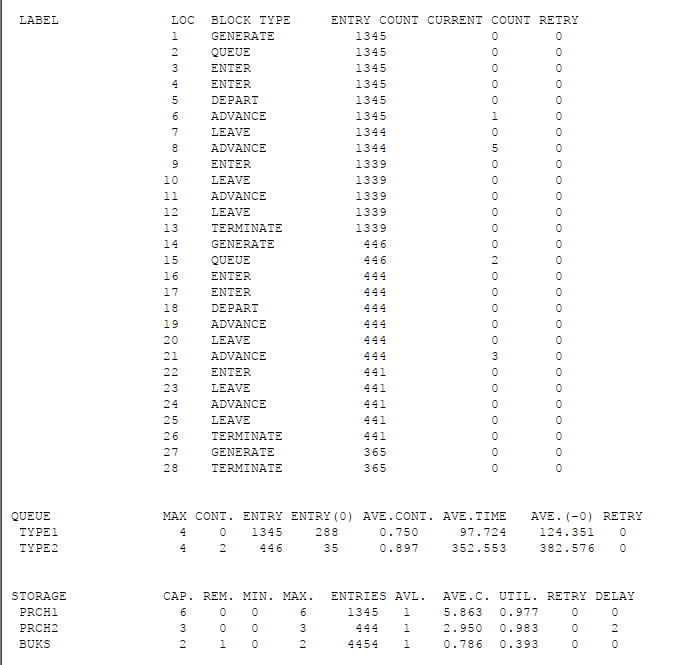

---
## Front matter
lang: ru-RU
title: Лабораторная работа 15
## subtitle: Простейший шаблон
author:
  - Тагиев Б. А.
institute:
  - Российский университет дружбы народов, Москва, Россия
date: 8 июня 2023

## i18n babel
babel-lang: russian
babel-otherlangs: english

## Formatting pdf
toc: false
toc-title: Содержание
slide_level: 2
aspectratio: 169
section-titles: true
theme: metropolis
mainfont: DejaVu Serif
romanfont: DejaVu Serif
sansfont: DejaVu Sans
monofont: DejaVu Sans Mono
header-includes:
 - \metroset{progressbar=frametitle,sectionpage=progressbar,numbering=fraction}
 - '\makeatletter'
 - '\beamer@ignorenonframefalse'
 - '\makeatother'
---

## Цель работы

Смоделировать "модель" обслуживания с приоритетами.

# Выполнение работы

## Модель обслуживания механиков на складе

1. Есть два различных типа заявок, поступающих на обслуживание к одному устройству. Различаются распределения интервалов приходов и времени обслуживания для этих типов заявок.

## Модель обслуживания механиков на складе

{width=30%}

## Модель обслуживания механиков на складе

2. Сформулируем отчет по модели. В нем видно, что всего заявок было 154, из них 71 первого типа (6 в очереди, 1 в обработке) и 83 второго типа (2 в очереди, 0 обрабатываются). Через нашего механика прошло 146 заявок.

{width=50%}

## Модель обслуживания в порту судов двух типов

1. Перейдем к модели обслуживания в порту судов двух типов. Требуется построить модель системы, в которой можно оценить время ожидания кораблями каждого типа входа в порт. Время ожидания входа в порт включает время ожидания освобождения причала и буксира. Корабль, ожидающий освобождения причала, не обслуживается буксиром до тех пор, пока не будет предоставлен нужный причал. Корабль второго типа не займёт буксир до тех пор, пока ему не будут доступны оба буксира.

## Модель обслуживания в порту судов двух типов

{width=50%}

## Модель обслуживания в порту судов двух типов

2. Сформулируем отчет по модели. Через наш порт прошло 1345 судов 1 типа и 446 судов второго типа. На первом причале у нас осталось 5 судов, на втором 3, при этом на второй причал еще есть очередь из 2 судов, а на первом причале еще происходит вход на порт.

## Модель обслуживания в порту судов двух типов

{width=50%}

## Выводы

Я смоделировал модель обслуживания с приоритетами.
