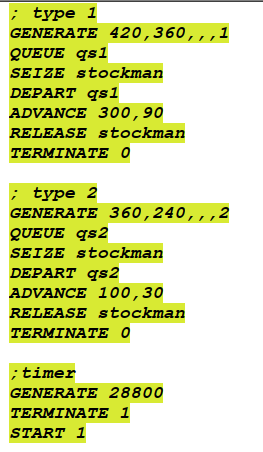
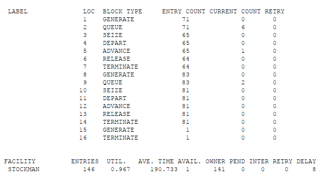
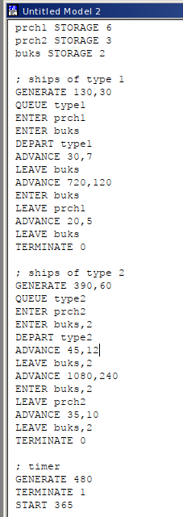
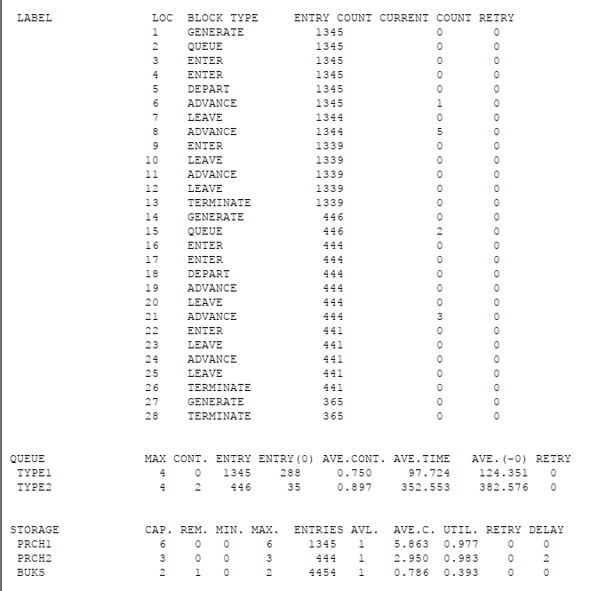

---
## Front matter
title: "Лабораторная работа 15"
##subtitle: "Простейший вариант"
author: "Тагиев Байрам Алтай оглы"

## Generic otions
lang: ru-RU
toc-title: "Содержание"

## Pdf output format
toc: true # Table of contents
toc-depth: 2
lof: true # List of figures
lot: true # List of tables
fontsize: 12pt
linestretch: 1.5
papersize: a4
documentclass: scrreprt
## I18n polyglossia
polyglossia-lang:
  name: russian
  options:
	- spelling=modern
	- babelshorthands=true
polyglossia-otherlangs:
  name: english
## I18n babel
babel-lang: russian
babel-otherlangs: english
## Fonts
mainfont: DejaVu Serif
romanfont: DejaVu Serif
sansfont: DejaVu Sans
monofont: DejaVu Sans Mono
mainfontoptions: Ligatures=TeX
romanfontoptions: Ligatures=TeX
sansfontoptions: Ligatures=TeX,Scale=MatchLowercase
monofontoptions: Scale=MatchLowercase,Scale=0.9
## Pandoc-crossref LaTeX customization
figureTitle: "Рис."
tableTitle: "Таблица"
listingTitle: "Листинг"
lofTitle: "Список иллюстраций"
lotTitle: "Список таблиц"
lolTitle: "Листинги"
## Misc options
indent: true
header-includes:
  - \usepackage{indentfirst}
  - \usepackage{float} # keep figures where there are in the text
  - \floatplacement{figure}{H} # keep figures where there are in the text 
  - \usepackage{pdflscape}
  - \newcommand{\blandscape}{\begin{landscape}}
  - \newcommand{\elandscape}{\end{landscape}}
---

# Цель работы

Смоделировать "модель" обслуживания с приоритетами. 

# Выполнение работы

## Модель обслуживания механиков на складе

1. Есть два различных типа заявок, поступающих на обслуживание к одному устройству. Различаются распределения интервалов приходов и времени обслуживания для этих типов заявок.

{width=50%}

2. Сформулируем отчет по модели. В нем видно, что всего заявок было 154, из них 71 первого типа (6 в очереди, 1 в обработке) и 83 второго типа (2 в очереди, 0 обрабатываются). Через нашего механика прошло 146 заявок.

{width=50%}

## Модель обслуживания в порту судов двух типов

1. Перейдем к модели обслуживания в порту судов двух типов. Требуется построить модель системы, в которой можно оценить время ожидания кораблями каждого типа входа в порт. Время ожидания входа в порт включает время ожидания освобождения причала и буксира. Корабль, ожидающий освобождения причала, не обслуживается буксиром до тех пор, пока не будет предоставлен нужный причал. Корабль второго типа не займёт буксир до тех пор, пока ему не будут доступны оба буксира.

{width=50%}

2. Сформулируем отчет по модели. Через наш порт прошло 1345 судов 1 типа и 446 судов второго типа. На первом причале у нас осталось 5 судов, на втором 3, при этом на второй причал еще есть очередь из 2 судов, а на первом причале еще происходит вход на порт.

{width=50%}

# Выводы

Я смоделировал модель обслуживания с приоритетами.

