---
## Front matter
lang: ru-RU
title: Лабораторная работа 16
## subtitle: Простейший шаблон
author:
  - Тагиев Б. А.
institute:
  - Российский университет дружбы народов, Москва, Россия
date: 10 июня 2023

## i18n babel
babel-lang: russian
babel-otherlangs: english

## Formatting pdf
toc: false
toc-title: Содержание
slide_level: 2
aspectratio: 169
section-titles: true
theme: metropolis
mainfont: DejaVu Serif
romanfont: DejaVu Serif
sansfont: DejaVu Sans
monofont: DejaVu Sans Mono
header-includes:
 - \metroset{progressbar=frametitle,sectionpage=progressbar,numbering=fraction}
 - \usepackage{multirow}
 - \usepackage{graphicx}
 - '\makeatletter'
 - '\beamer@ignorenonframefalse'
 - '\makeatother'
---
## Цель работы

Смоделировать "модель" двух стратегий обслуживания.

# Выполнение работы

## Задача

Предлагается две стратегии обслуживания прибывающих автомобилей:

1. автомобили образуют две очереди и обслуживаются соответствующими пунктами
пропуска;

2. автомобили образуют одну общую очередь и обслуживаются освободившимся
пунктом пропуска.

## Моделирование первой стратегии

1. Для первой стратегии обслуживания, когда прибывающие автомобили образуют две очереди и обслуживаются соответствующими пропускными пунктами, имеем следующую модель

## Моделирование первой стратегии

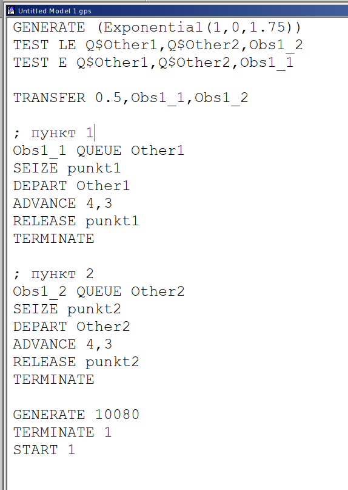{width=30%}

## Моделирование первой стратегии

2. Сформируем отчет, поступило 5853 автомобиля, в первый пункт 2928 (2541 обслужено), во второй 2925 (2537 обслужено). Коеффициент нагрузки 0.997 и 0.996 соответственно.

## Моделирование первой стратегии

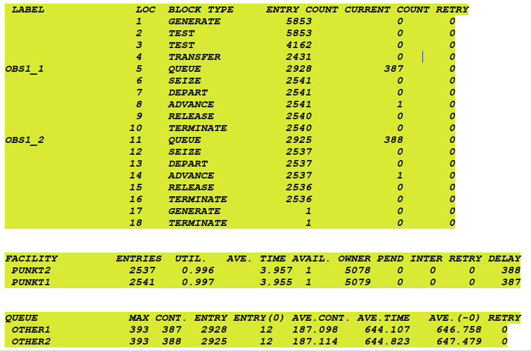{width=40%}

## Моделирование второй стратегии

1. Для второй стратегии обслуживания, когда прибывающие автомобили образуют одну общую очередь и обслуживаются освободившимся пунктом пропуска.

## Моделирование второй стратегии

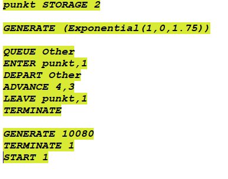{width=40%}

## Моделирование второй стратегии

2. Сформируем отчет, поступило 5719 автомобиля, было обслужено 5049.

## Моделирование второй стратегии

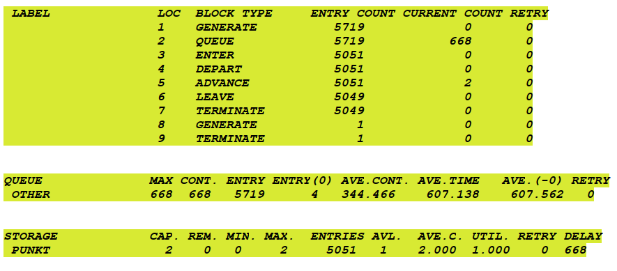{width=40%}

## Сравнение стратегий

1. Составим таблицу с необходимыми результатами для сравнения \ref{tab:title}. В ней можно явно наблюдать, что вторая стратегия работает лучше, среднее время ожидания меньше, длина очереди также меньше, при почти одинаковом количестве обслуженных автомобилей.

## Сравнение стратегий

\begin{table}[]
\resizebox{\textwidth}{!}{%
\begin{tabular}{|l|lll|l|}
\hline
\multicolumn{1}{|c|}{\multirow{2}{*}{Показатель}} & \multicolumn{3}{l|}{стратегия 1} & \multirow{2}{*}{стратегия 2} \\ \cline{2-4}
\multicolumn{1}{|c|}{}     & \multicolumn{1}{l|}{пункт 1} & \multicolumn{1}{l|}{пункт 2} & в целом &         \\ \hline
Поступило автомобилей      & \multicolumn{1}{l|}{2928}    & \multicolumn{1}{l|}{2925}    & 5853    & 5719    \\ \hline
Обслужено автомобилей      & \multicolumn{1}{l|}{2541}    & \multicolumn{1}{l|}{2537}    & 5078    & 5049    \\ \hline
Коэффициент загрузки       & \multicolumn{1}{l|}{0.997}   & \multicolumn{1}{l|}{0.996}   & 0.997   & 1       \\ \hline
Максимальная длина очереди & \multicolumn{1}{l|}{393}     & \multicolumn{1}{l|}{393}     & 786     & 668     \\ \hline
Средняя длина очереди      & \multicolumn{1}{l|}{187.098} & \multicolumn{1}{l|}{187.114} & 374.212 & 344.466 \\ \hline
Среднее время ожидания     & \multicolumn{1}{l|}{644.107} & \multicolumn{1}{l|}{644.823} & 644.465 & 607.138 \\ \hline
\end{tabular}%
}
\end{table}

## Оптимизация

1. Для первой стратегии изменим количество КПП для соответствия следующим условиям:

 - коэффициент загрузки пропускных пунктов принадлежит интервалу [0,5; 0,95];

 - среднее число автомобилей, одновременно находящихся на контрольно-пропускном пункте, не должно превышать 3;

 - среднее время ожидания обслуживания не должно превышать 4 мин.

## Оптимизация

2. Для первой стратегии минимальное количество КПП, необходимое для соответствия вышеописанным условиям является 4. При меньших параметрах не выполняются определнные условия.

## Оптимизация

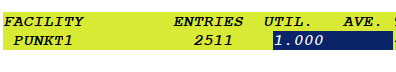{width=40%}

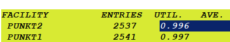{width=40%}

## Оптимизация

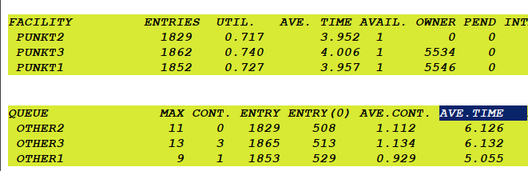{width=40%}

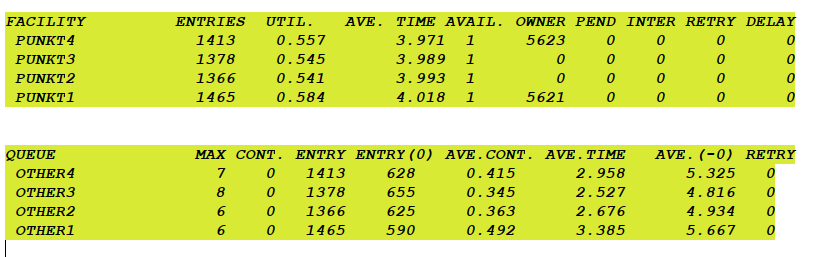{width=40%}

## Оптимизация

2. Сделаем тоже самое для второй стратегии. Для второй минимальное количество кпп равно 3 (также можно использовать 4).

## Оптимизация

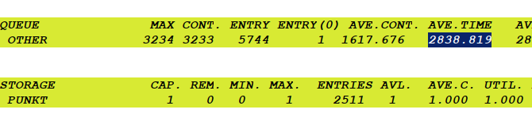{width=40%}

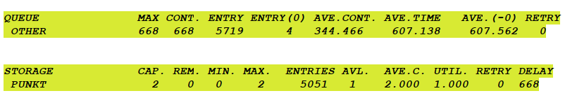{width=40%}

## Оптимизация

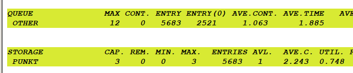{width=40%}

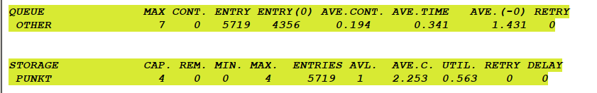{width=40%}

## Выводы

Я смоделировал модель двух стратегий обслуживания.
