---
## Front matter
title: "Лабораторная работа 16"
##subtitle: "Простейший вариант"
author: "Тагиев Байрам Алтай оглы"

## Generic otions
lang: ru-RU
toc-title: "Содержание"

## Pdf output format
toc: true # Table of contents
toc-depth: 2
lof: true # List of figures
lot: true # List of tables
fontsize: 12pt
linestretch: 1.5
papersize: a4
documentclass: scrreprt
## I18n polyglossia
polyglossia-lang:
  name: russian
  options:
	- spelling=modern
	- babelshorthands=true
polyglossia-otherlangs:
  name: english
## I18n babel
babel-lang: russian
babel-otherlangs: english
## Fonts
mainfont: DejaVu Serif
romanfont: DejaVu Serif
sansfont: DejaVu Sans
monofont: DejaVu Sans Mono
mainfontoptions: Ligatures=TeX
romanfontoptions: Ligatures=TeX
sansfontoptions: Ligatures=TeX,Scale=MatchLowercase
monofontoptions: Scale=MatchLowercase,Scale=0.9
## Pandoc-crossref LaTeX customization
figureTitle: "Рис."
tableTitle: "Таблица"
listingTitle: "Листинг"
lofTitle: "Список иллюстраций"
lotTitle: "Список таблиц"
lolTitle: "Листинги"
## Misc options
indent: true
header-includes:
  - \usepackage{indentfirst}
  - \usepackage{float} # keep figures where there are in the text
  - \usepackage{multirow}
  - \usepackage{graphicx}
  - \floatplacement{figure}{H} # keep figures where there are in the text 
  - \usepackage{pdflscape}
  - \newcommand{\blandscape}{\begin{landscape}}
  - \newcommand{\elandscape}{\end{landscape}}
---

# Цель работы

Смоделировать "модель" двух стратегий обслуживания. 

# Выполнение работы

## Задача

Предлагается две стратегии обслуживания прибывающих автомобилей:

1. автомобили образуют две очереди и обслуживаются соответствующими пунктами
пропуска;

2. автомобили образуют одну общую очередь и обслуживаются освободившимся
пунктом пропуска.

## Моделирование первой стратегии

1. Для первой стратегии обслуживания, когда прибывающие автомобили образуют две очереди и обслуживаются соответствующими пропускными пунктами, имеем следующую модель

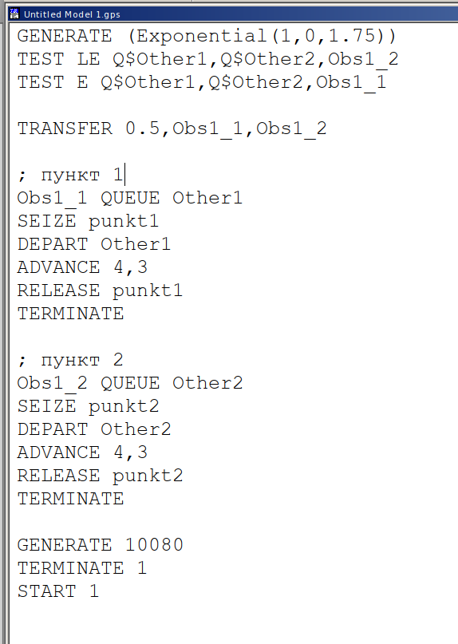{width=40%}

2. Сформируем отчет, поступило 5853 автомобиля, в первый пункт 2928 (2541 обслужено), во второй 2925 (2537 обслужено). Коеффициент нагрузки 0.997 и 0.996 соответственно.

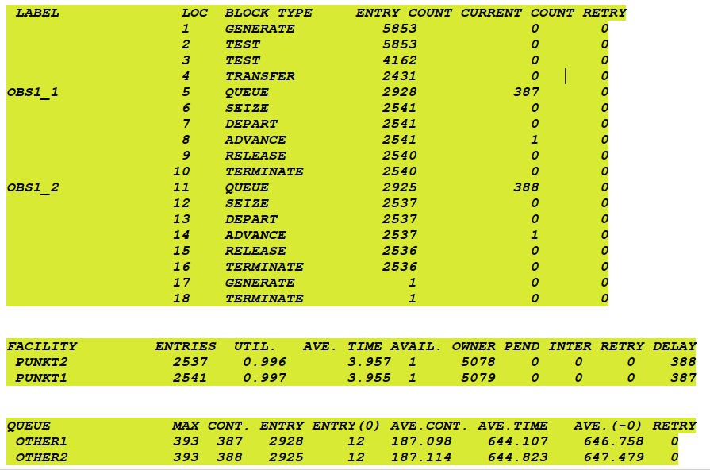{width=40%}

## Моделирование второй стратегии

1. Для второй стратегии обслуживания, когда прибывающие автомобили образуют одну общую очередь и обслуживаются освободившимся пунктом пропуска.

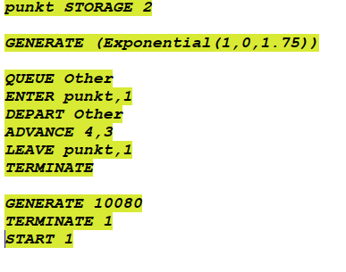{width=40%}

2. Сформируем отчет, поступило 5719 автомобиля, было обслужено 5049.

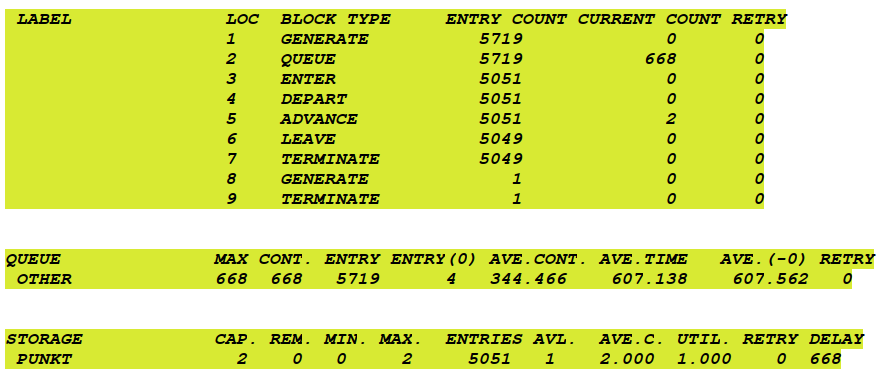{width=40%}

## Сравнение стратегий

1. Составим таблицу с необходимыми результатами для сравнения \ref{tab:title}. В ней можно явно наблюдать, что вторая стратегия работает лучше, среднее время ожидания меньше, длина очереди также меньше, при почти одинаковом количестве обслуженных автомобилей.

\begin{table}[]
\caption {Сравнение стратегий} \label{tab:title}
\resizebox{\textwidth}{!}{%
\begin{tabular}{|l|lll|l|}
\hline
\multicolumn{1}{|c|}{\multirow{2}{*}{Показатель}} & \multicolumn{3}{l|}{стратегия 1} & \multirow{2}{*}{стратегия 2} \\ \cline{2-4}
\multicolumn{1}{|c|}{}     & \multicolumn{1}{l|}{пункт 1} & \multicolumn{1}{l|}{пункт 2} & в целом &         \\ \hline
Поступило автомобилей      & \multicolumn{1}{l|}{2928}    & \multicolumn{1}{l|}{2925}    & 5853    & 5719    \\ \hline
Обслужено автомобилей      & \multicolumn{1}{l|}{2541}    & \multicolumn{1}{l|}{2537}    & 5078    & 5049    \\ \hline
Коэффициент загрузки       & \multicolumn{1}{l|}{0.997}   & \multicolumn{1}{l|}{0.996}   & 0.997   & 1       \\ \hline
Максимальная длина очереди & \multicolumn{1}{l|}{393}     & \multicolumn{1}{l|}{393}     & 786     & 668     \\ \hline
Средняя длина очереди      & \multicolumn{1}{l|}{187.098} & \multicolumn{1}{l|}{187.114} & 374.212 & 344.466 \\ \hline
Среднее время ожидания     & \multicolumn{1}{l|}{644.107} & \multicolumn{1}{l|}{644.823} & 644.465 & 607.138 \\ \hline
\end{tabular}%
}
\end{table}

## Оптимизация

1. Для первой стратегии изменим количество КПП для соответствия следующим условиям:

 - коэффициент загрузки пропускных пунктов принадлежит интервалу [0,5; 0,95];

 - среднее число автомобилей, одновременно находящихся на контрольно-пропускном пункте, не должно превышать 3;

 - среднее время ожидания обслуживания не должно превышать 4 мин.

2. Для первой стратегии минимальное количество КПП, необходимое для соответствия вышеописанным условиям является 4 (@fig:004). При меньших параметрах ([@fig:001;@fig:002;@fig:003]) не выполняются определнные условия.

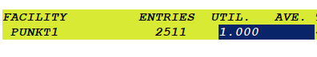{#fig:001} 

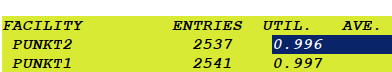{#fig:002} 

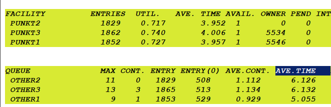{#fig:003} 

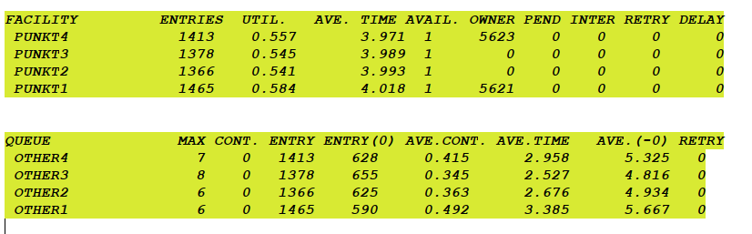{#fig:004} 

2. Сделаем тоже самое для второй стратегии. Для второй минимальное количество кпп равно 3 (также можно использовать 4).

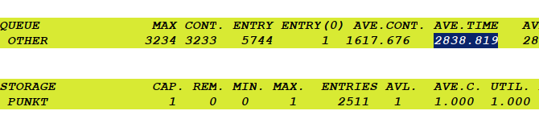{#fig:005} 

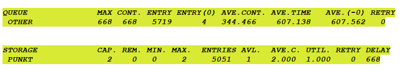{#fig:006} 

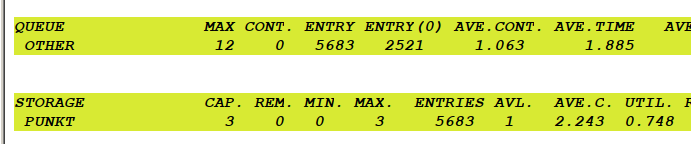{#fig:007} 

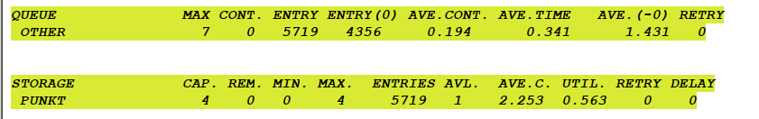{#fig:008} 

# Выводы

Я смоделировал модель двух стратегий обслуживания.
