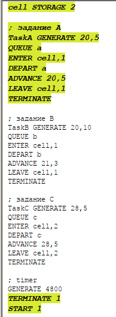
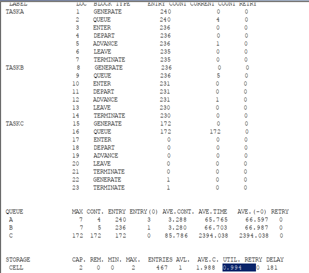
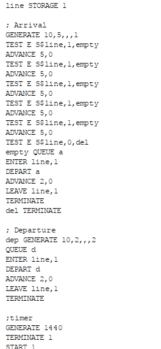
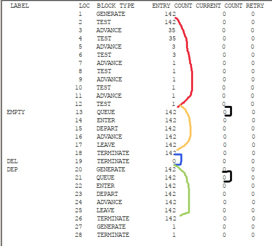
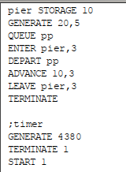
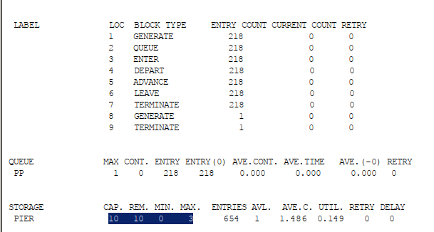
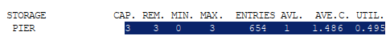
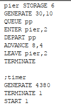
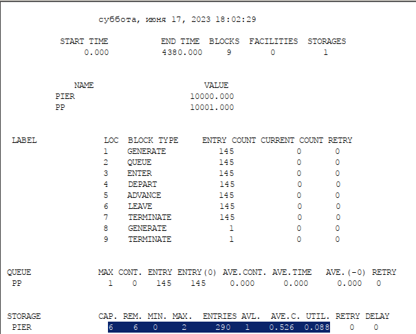
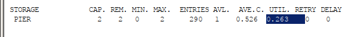

---
## Front matter
lang: ru-RU
title: Лабораторная работа 17
## subtitle: Простейший шаблон
author:
  - Тагиев Б. А.
institute:
  - Российский университет дружбы народов, Москва, Россия
date: 17 июня 2023

## i18n babel
babel-lang: russian
babel-otherlangs: english

## Formatting pdf
toc: false
toc-title: Содержание
slide_level: 2
aspectratio: 169
section-titles: true
theme: metropolis
mainfont: DejaVu Serif
romanfont: DejaVu Serif
sansfont: DejaVu Sans
monofont: DejaVu Sans Mono
header-includes:
 - \metroset{progressbar=frametitle,sectionpage=progressbar,numbering=fraction}
 - \usepackage{multirow}
 - \usepackage{graphicx}
 - '\makeatletter'
 - '\beamer@ignorenonframefalse'
 - '\makeatother'
---

## Цель работы

Решить три задачи для самостоятельного выполнения.

# Выполнение работы

## Задача 1

На вычислительном центре в обработку принимаются три класса заданий А, В и С. Исходя из наличия оперативной памяти ЭВМ задания классов А и В могут решаться одновременно, а задания класса С монополизируют ЭВМ. Задания класса А поступают через 20 ± 5 мин, класса В — через 20 ± 10 мин, класса С — через 28 ± 5 мин и требуют для выполнения: класс А — 20 ± 5 мин, класс В — 21 ± 3 мин, класс С — 28 ± 5 мин. Задачи класса С загружаются в ЭВМ, если она полностью свободна. Задачи классов А и В могут дозагружаться к решающей задаче. Смоделировать работу ЭВМ за 80 ч. Определить её загрузку.

## Решение

1. Исходный код выглядит следующим образом. Здесь мы задаем cell, отвечающий за работу какого-либо процесса и в процессах занимаем необходимое для процесса поле. Ограничение на 2 поставлено специально, т. к. задача C должна выполняться только тогда, когда ЭВМ свободна. Остальное, в целом, очевидно и не требует объяснений.

## Решение

{width=50%}

## Решение

2. В результате получим отчет, было создано 240 задач А, 236 задач В и 172 задачи С, при этом ни одна задача С не выполнилась. Загрузка ЭВМ равна 0.994.

{width=50%}

## Задача 2

Самолёты прибывают для посадки в район аэропорта каждые 10 ± 5 мин. Если взлетно- посадочная полоса свободна, прибывший самолёт получает разрешение на посадку. Если полоса занята, самолет выполняет полет по кругу и возвращается в аэропорт каждые 5 мин. Если после пятого круга самолет не получает разрешения на посадку, он отправляется на запасной аэродром.

В аэропорту через каждые 10 ± 2 мин к взлетно -посадочной полосе выруливают готовые к взлёту самолёты и получают разрешение на взлёт, если полоса свободна. Для взлета и посадки самолёты занимают полосу ровно на 2 мин. Если при свободной полосе одновременно один самолёт прибывает для посадки, а другой — для взлёта, то полоса предоставляется взлетающей машине.

## Задача 2

Требуется:

 - выполнить моделирование работы аэропорта в течение суток;

 - подсчитать количество самолётов, которые взлетели, сели и были направлены на запасной аэродром;

 - определить коэффициент загрузки взлетно-посадочной полосы.

## Решение

1. Исходный код выглядит следующим образом. У нас есть 1 полоса, которую занимают в процессе работы либо при посадке, либо при взлете. При генерации задаем больший приоритет для тех, кто вылетает. Через TEST проводим проверку на свободную полосу.

## Решение

{width=50%}

## Решение

2. В результате получим отчет, прилетело 142 самолета, улетело также 142 самолета. На запасной аэродром было направлено 0 самолетов. Красное - проверка на то, что у полоса свободна, там только 1 крутил все пять кругов, но все равно сел. Если бы самолет не смог сесть, он бы попал в синюю зону, но тут 0. Желтая зона показывает обработку самолетов, которые сели - они все были обработаны. Зеленым это те, которые вылетают. Все вылетели - никакой очереди не осталось - отметил черным.

## Решение

{width=50%}

## Задача 3

Морские суда прибывают в порт каждые [a ± δ] часов. В порту имеется N причалов. Каждый корабль по длине занимает M причалов и находится в порту [b ± ε] часов. Требуется построить GPSS-модель для анализа работы морского порта в течение полугода, определить оптимальное количество причалов для эффективной работы порта.

Исходные данные:
1. a = 20 ч, δ = 5 ч, b = 10 ч, ε = 3 ч, N = 10, M = 3;
2. a = 30 ч, δ = 10 ч, b = 8 ч, ε = 4 ч, N = 6, M = 2.

## Решение для 1 пунтка

1. Исходный код выглядит следующим образом. Pier показывает у нас количество причалов. Остальное не нуждается в объяснении.

## Решение для 1 пунтка

{width=50%}

## Решение для 1 пунтка

2. Получим следующие исходные данные, 218 судов прошло, максимально используемое количество причалов 3. Утилизация составила 0.149 - наши причалы простаивают без дела.

{width=50%}

## Решение для 1 пунтка

3. Оптимальным решением будет использовать 3 причала, при этом утилизация все еще не максимальная, что говорит нам о возможности увеличения судов, без необходимости увеличения количества судов.

{width=50%}

## Решение для 2 пунтка

1. Исходный код выглядит следующим образом. Pier показывает у нас количество причалов. Остальное не нуждается в объяснении.

## Решение для 2 пунтка

{width=50%}

## Решение для 2 пунтка

2. Получим следующие исходные данные, 145 судов прошло, максимально используемое количество причалов 2. Утилизация составила 0.088 - наши причалы простаивают без дела.

{width=50%}

## Решение для 2 пунтка

3. Оптимальным решением будет использовать 2 причала, при этом утилизация все еще не максимальная, что говорит нам о возможности увеличения судов, без необходимости увеличения количества судов.

{width=50%}

## Выводы

Я решил 3 задачи для самостоятельного выполнения.
