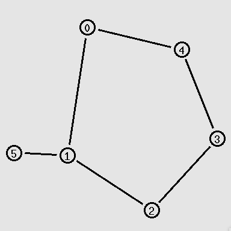
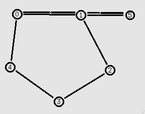
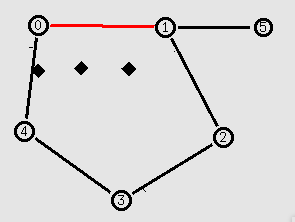

---
## Front matter
title: "Лабораторная работа 1"
##subtitle: "Простейший вариант"
author: "Тагиев Байрам Алтай оглы"

## Generic otions
lang: ru-RU
toc-title: "Содержание"

## Pdf output format
toc: true # Table of contents
toc-depth: 2
lof: true # List of figures
lot: true # List of tables
fontsize: 12pt
linestretch: 1.5
papersize: a4
documentclass: scrreprt
## I18n polyglossia
polyglossia-lang:
  name: russian
  options:
	- spelling=modern
	- babelshorthands=true
polyglossia-otherlangs:
  name: english
## I18n babel
babel-lang: russian
babel-otherlangs: english
## Fonts
mainfont: DejaVu Serif
romanfont: DejaVu Serif
sansfont: DejaVu Sans
monofont: DejaVu Sans Mono
mainfontoptions: Ligatures=TeX
romanfontoptions: Ligatures=TeX
sansfontoptions: Ligatures=TeX,Scale=MatchLowercase
monofontoptions: Scale=MatchLowercase,Scale=0.9
## Pandoc-crossref LaTeX customization
figureTitle: "Рис."
tableTitle: "Таблица"
listingTitle: "Листинг"
lofTitle: "Список иллюстраций"
lotTitle: "Список таблиц"
lolTitle: "Листинги"
## Misc options
indent: true
header-includes:
  - \usepackage{indentfirst}
  - \usepackage{float} # keep figures where there are in the text
  - \floatplacement{figure}{H} # keep figures where there are in the text 
  - \usepackage{pdflscape}
  - \newcommand{\blandscape}{\begin{landscape}}
  - \newcommand{\elandscape}{\end{landscape}}
---

# Цель работы

Приобретение навыков моделирования сетей передачи данных с помощью средства имитационного моделирования NS-2, а также анализ полученных результатов моделирования.

# Задание

Внесите следующие изменения в реализацию примера с кольцевой топологией сети:

- топология сети должна соответствовать представленной на (@fig:000)

{#fig:000 width=50%}

 - передача данных должна осуществляться от узла n(0) до узла n(5) по кратчай-
шему пути в течение 5 секунд модельного времени;

 - передача данных должна идти по протоколу TCP (тип Newreno), на принимаю-
щей стороне используется TCPSink-объект типа DelAck; поверх TCP работает
протокол FTP с 0,5 до 4,5 секунд модельного времени;
 
 - с 1 по 2 секунду модельного времени происходит разрыв соединения между
узлами n(0) и n(1);
 
 - при разрыве соединения маршрут передачи данных должен измениться на ре-
зервный, после восстановления соединения пакеты снова должны пойти по
кратчайшему пути.

# Выполнение лабораторной работы

1. Для начала создадим симулятор, файл анимации и трассировки.

{#fig:001 width=70%}

2. Далее создадим наши узлы при помощи цикла и соединим соответствующие узлы по схеме, представленной на (@fig:000)

{#fig:002 width=70%}

3. Теперь зададим соединение между узлами `0` и `5`. Передачу данных по TCP Newreno, на принимающей стороне TCPSink DelAck. Также, поверх TCP работает FTP.

{#fig:003 width=70%}

4. Теперь мы сделаем разметку модельного времени. На 0.5 секунде запустим FTP. На 1 секунде разорвем соединение между узлами `0` и `1`, чтобы трафик пошел по другому пути кольца. На 2 секунде востановим соединение и далее мы увидим, что трафик пошел по кратчайшему пути. Далее остановим FTP и запустим процедуру `finish`.

{#fig:004 width=70%}

5. Запустим моделирование и посмотрим на результат. Сначала, мы видим как пакеты идут по кратчайшему пути, через `0-1-5`.

{#fig:005 width=90%}

6. Далее, на 1 секунде у нас происходит разрыв соединения между `0-1`. И пакеты теряются.

{#fig:006 width=90%}

7. Затем происходит изменение маршрута передачи данных.

{#fig:007 width=90%}

8. После происходит востановление пути и изменение маршрута передачи данных.

# Выводы

По мере выполнения работы, я приобрел практические навыки моделирования сетей передачи данных с помощью средства имитационного моделирования NS-2, а также проанализировал результаты моделирования.

