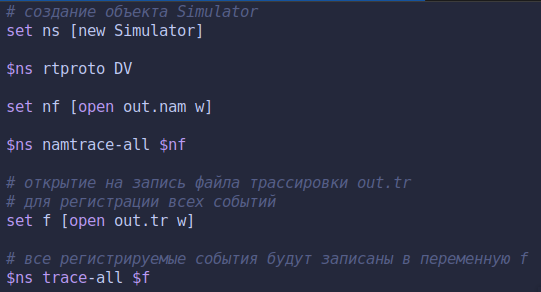
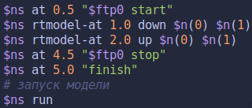

---
## Front matter
lang: ru-RU
title: Лабораторная работа 1
## subtitle: Простейший шаблон
author:
  - Тагиев Б. А.
institute:
  - Российский университет дружбы народов, Москва, Россия
date: 22 апреля 2023

## i18n babel
babel-lang: russian
babel-otherlangs: english

## Formatting pdf
toc: false
toc-title: Содержание
slide_level: 2
aspectratio: 169
section-titles: true
theme: metropolis
mainfont: DejaVu Serif
romanfont: DejaVu Serif
sansfont: DejaVu Sans
monofont: DejaVu Sans Mono
header-includes:
 - \metroset{progressbar=frametitle,sectionpage=progressbar,numbering=fraction}
 - '\makeatletter'
 - '\beamer@ignorenonframefalse'
 - '\makeatother'
---

## Цель работы

Приобретение навыков моделирования сетей передачи данных с помощью средства имитационного моделирования NS-2, а также анализ полученных результатов моделирования.

## Задание

Внесите следующие изменения в реализацию примера с кольцевой топологией сети:

- топология сети должна соответствовать представленной на рисунке

{width=20%}

## Задание

 - передача данных должна осуществляться от узла n(0) до узла n(5) по кратчай-
шему пути в течение 5 секунд модельного времени;

 - передача данных должна идти по протоколу TCP (тип Newreno), на принимаю-
щей стороне используется TCPSink-объект типа DelAck; поверх TCP работает
протокол FTP с 0,5 до 4,5 секунд модельного времени;
 
## Задание

 - с 1 по 2 секунду модельного времени происходит разрыв соединения между
узлами n(0) и n(1);
 
 - при разрыве соединения маршрут передачи данных должен измениться на ре-
зервный, после восстановления соединения пакеты снова должны пойти по
кратчайшему пути.

## Выполнение лабораторной работы

1. Для начала создадим симулятор, файл анимации и трассировки.

{width=70%}

## Выполнение лабораторной работы

2. Далее создадим наши узлы при помощи цикла и соединим соответствующие узлы по схеме, представленной ранее.

{width=70%}

## Выполнение лабораторной работы

3. Теперь зададим соединение между узлами `0` и `5`. Передачу данных по TCP Newreno, на принимающей стороне TCPSink DelAck. Также, поверх TCP работает FTP.

{width=70%}

## Выполнение лабораторной работы

4. Теперь мы сделаем разметку модельного времени. На 0.5 секунде запустим FTP. На 1 секунде разорвем соединение между узлами `0` и `1`, чтобы трафик пошел по другому пути кольца. На 2 секунде востановим соединение и далее мы увидим, что трафик пошел по кратчайшему пути. Далее остановим FTP и запустим процедуру `finish`.

## Выполнение лабораторной работы

{width=70%}

## Выполнение лабораторной работы

5. Запустим моделирование и посмотрим на результат. Сначала, мы видим как пакеты идут по кратчайшему пути, через `0-1-5`.

{width=50%}

## Выполнение лабораторной работы

6. Далее, на 1 секунде у нас происходит разрыв соединения между `0-1`. И пакеты теряются.

{width=50%}

## Выполнение лабораторной работы

7. Затем происходит изменение маршрута передачи данных.

{width=50%}

## Выполнение лабораторной работы

8. После происходит востановление пути и изменение маршрута передачи данных.

## Выводы

По мере выполнения работы, я приобрел практические навыки моделирования сетей передачи данных с помощью средства имитационного моделирования NS-2, а также проанализировал результаты моделирования.

