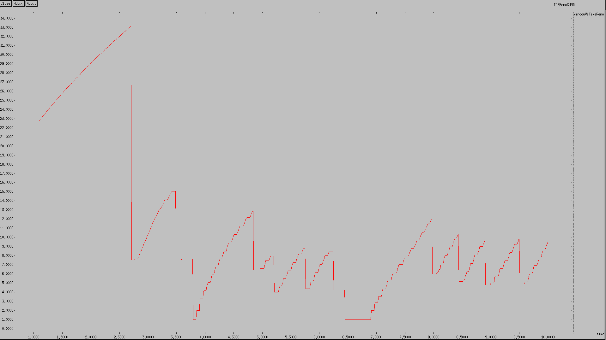
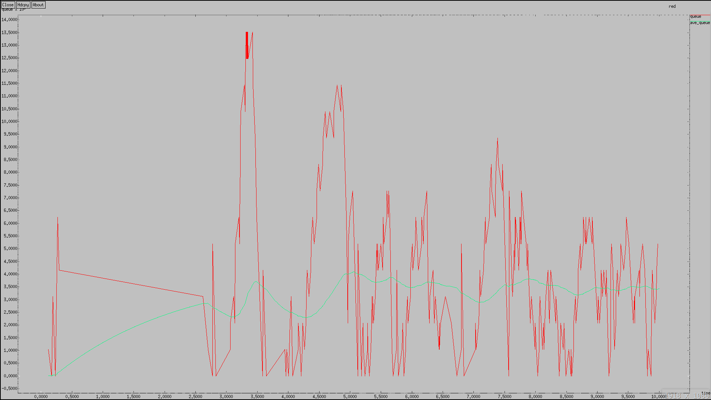
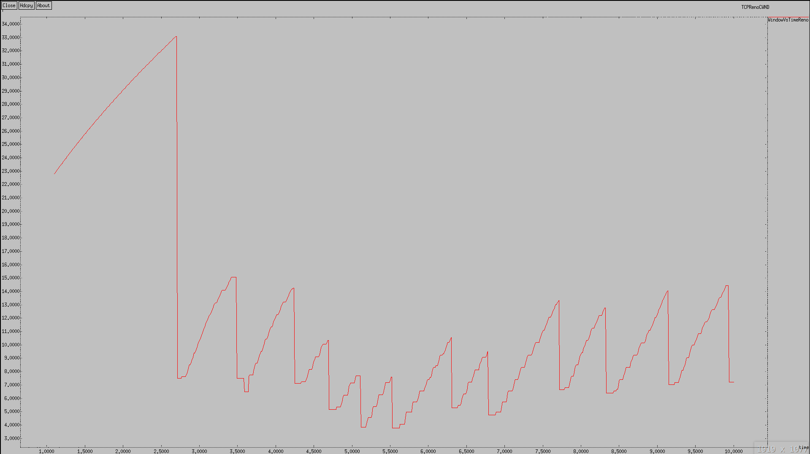
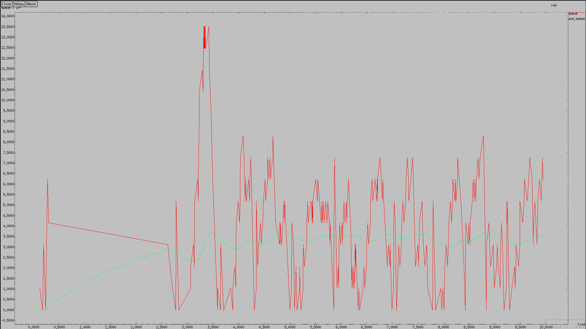
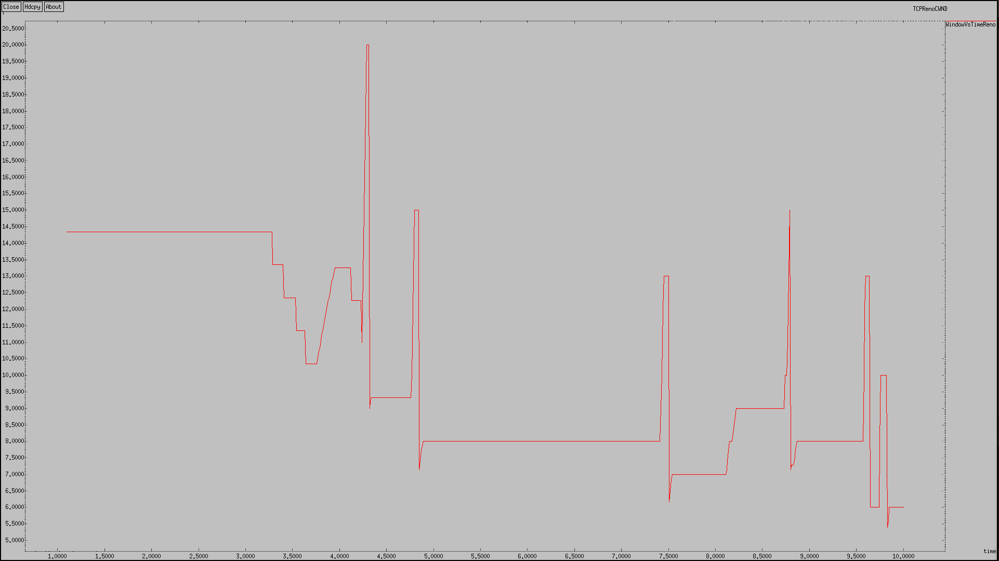
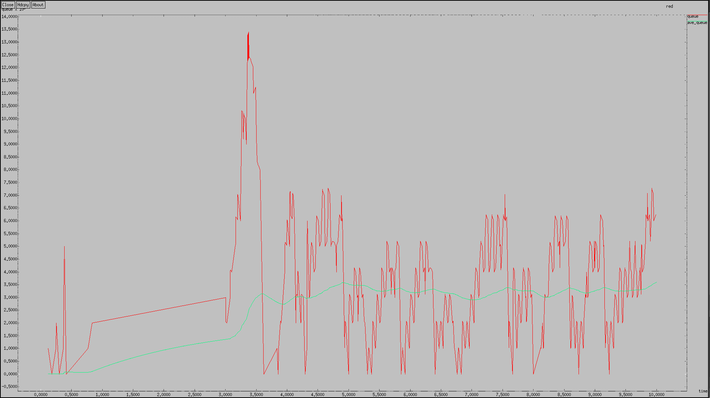

---
## Front matter
title: "Лабораторная работа 2"
##subtitle: "Простейший вариант"
author: "Тагиев Байрам Алтай оглы"

## Generic otions
lang: ru-RU
toc-title: "Содержание"

## Pdf output format
toc: true # Table of contents
toc-depth: 2
lof: true # List of figures
lot: true # List of tables
fontsize: 12pt
linestretch: 1.5
papersize: a4
documentclass: scrreprt
## I18n polyglossia
polyglossia-lang:
  name: russian
  options:
	- spelling=modern
	- babelshorthands=true
polyglossia-otherlangs:
  name: english
## I18n babel
babel-lang: russian
babel-otherlangs: english
## Fonts
mainfont: DejaVu Serif
romanfont: DejaVu Serif
sansfont: DejaVu Sans
monofont: DejaVu Sans Mono
mainfontoptions: Ligatures=TeX
romanfontoptions: Ligatures=TeX
sansfontoptions: Ligatures=TeX,Scale=MatchLowercase
monofontoptions: Scale=MatchLowercase,Scale=0.9
## Pandoc-crossref LaTeX customization
figureTitle: "Рис."
tableTitle: "Таблица"
listingTitle: "Листинг"
lofTitle: "Список иллюстраций"
lotTitle: "Список таблиц"
lolTitle: "Листинги"
## Misc options
indent: true
header-includes:
  - \usepackage{indentfirst}
  - \usepackage{float} # keep figures where there are in the text
  - \floatplacement{figure}{H} # keep figures where there are in the text 
  - \usepackage{pdflscape}
  - \newcommand{\blandscape}{\begin{landscape}}
  - \newcommand{\elandscape}{\end{landscape}}
---

# Цель работы

Получение навыков по работе с NS2, моделирование сети с применением RED.

# Задание

Постановка задачи Описание моделируемой сети:
 
 - сеть состоит из 6 узлов;

 - между всеми узлами установлено дуплексное соединение с различными пропускной способностью и задержкой 10 мс;
 
 - узел r1 использует очередь с дисциплиной RED для накопления пакетов, максимальный размер которой составляет 25;

 - TCP-источники на узлах s1 и s2 подключаются к TCP-приёмнику на узле s3;

 - генераторы трафика FTP прикреплены к TCP-агентам.

# Выполнение лабораторной работы

1. Создадим наши узлы сети.

```tcl
set N 5
for {set i 1} {$i < $N} {incr i} {
	set node_(s$i) [$ns node]
}
set node_(r1) [$ns node]
set node_(r2) [$ns node]
```

2. Зададим соединения между узлами.

```tcl
$ns duplex-link $node_(s1) $node_(r1) 10Mb 2ms DropTail
$ns duplex-link $node_(s2) $node_(r1) 10Mb 3ms DropTail
$ns duplex-link $node_(r1) $node_(r2) 1.5Mb 20ms RED
$ns queue-limit $node_(r1) $node_(r2) 25
$ns queue-limit $node_(r2) $node_(r1) 25
$ns duplex-link $node_(s3) $node_(r2) 10Mb 4ms DropTail
$ns duplex-link $node_(s4) $node_(r2) 10Mb 5ms DropTail
```

3. Добавим агентов и приложения

```tcl
set tcp1 [$ns create-connection TCP/Reno $node_(s1) TCPSink $node_(s3) 0]
$tcp1 set window_ 15
set tcp2 [$ns create-connection TCP/Reno $node_(s2) TCPSink $node_(s3) 1]
$tcp2 set window_ 15
set ftp1 [$tcp1 attach-source FTP]
set ftp2 [$tcp2 attach-source FTP]
```

4. Добавим мониторинг размера окна.

```tcl
set windowVsTime [open WindowVsTimeReno w]
set qmon [$ns monitor-queue $node_(r1) $node_(r2) [open qm.out w] 0.1];
[$ns link $node_(r1) $node_(r2)] queue-sample-timeout;
```

5. Также добавим мониторинг очереди.

```tcl
set redq [[$ns link $node_(r1) $node_(r2)] queue]
set tchan_ [open all.q w]
$redq trace curq_
$redq trace ave_
$redq attach $tchan_
```

6. Добавим допольнительную процедуру для формирования файла с данными о размере окна TCP. Не самое

7. И получим следующие графики.

{#Reno1 width=50%}

{#Reno2 width=50%}

8. Давайте проверим другие типы протоколов. Начнем с NewReno. Работает немного эффективнее, но схожа с Reno.

{#Newreno1 width=50%}

{#Newreno2 width=50%}

9. Но мы можем еще улучшить наши результаты, применив друго тип протокола TCP - Vegas.

{#Vegas1 width=50%}

{#Vegas2 width=50%}

10.  Если нам понадобиться поменять как-то кривую, то можно изменять параметры `xgraph`, который используется для отрисовки графиков.

https://manpages.ubuntu.com/manpages/xenial/man1/xgraph.1.html

# Выводы

По мере выполнения работы, я приобрел практические навыки моделирования сетей передачи данных с помощью средства имитационного моделирования NS-2, а также смоделировал сеть с RED.

