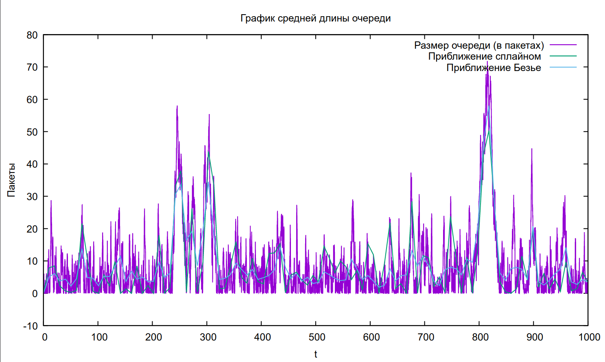

---
## Front matter
lang: ru-RU
title: Лабораторная работа 3
## subtitle: Простейший шаблон
author:
  - Тагиев Б. А.
institute:
  - Российский университет дружбы народов, Москва, Россия
date: 29 апреля 2023

## i18n babel
babel-lang: russian
babel-otherlangs: english

## Formatting pdf
toc: false
toc-title: Содержание
slide_level: 2
aspectratio: 169
section-titles: true
theme: metropolis
mainfont: DejaVu Serif
romanfont: DejaVu Serif
sansfont: DejaVu Sans
monofont: DejaVu Sans Mono
header-includes:
 - \metroset{progressbar=frametitle,sectionpage=progressbar,numbering=fraction}
 - '\makeatletter'
 - '\beamer@ignorenonframefalse'
 - '\makeatother'
---

## Цель работы

Смоделировать стохастический процесс, сделать реализацию NS2.

## Выполнение лабораторной работы

1. Зададим начальные параметры: параметры системы, размер очереди, длительность моделирования.

```tcl
set lambda 30.0
set mu 33.0

set qsize 100000

set duration 1000.0
```

## Выполнение лабораторной работы

2. Создаем два узла и соединяем их, накладывая ограничения.

```tcl
set n1 [$ns node]
set n2 [$ns node]

set link [$ns simplex-link $n1 $n2 100kb 0ms DropTail]

$ns queue-limit $n1 $n2 $qsize
```

## Выполнение лабораторной работы

3. Задаем распределние интервалов времени поступления пакетов, а также размера пакетов.

```tcl
set InterArrivalTime [new RandomVariable/Exponential]
$InterArrivalTime set avg_ [expr 1/$lambda]
set pktSize [new RandomVariable/Exponential]
$pktSize set avg_ [expr 100000.0/(8*$mu)]
```

## Выполнение лабораторной работы

4. Задаем агента UDP и присоединяем к источнику, задаем размер пакета. Также, создаем агент-приемника и мониторинг очереди.

```tcl
set src [new Agent/UDP]
$src set packetSize_ 100000
$ns attach-agent $n1 $src

set sink [new Agent/Null]
$ns attach-agent $n2 $sink
$ns connect $src $sink

set qmon [$ns monitor-queue $n1 $n2 [open qm.out w] 0.1]
$link queue-sample-timeout
```

## Выполнение лабораторной работы

5. Задаем наши процедуры `finish` и `sendpacket`.

6. Также создаем скрипт для GNUPlot, который будут генерировать нам график в PDF.

## Выполнение лабораторной работы

7. В результате получим следующий график.

{width=50%}

## Выводы

По мере выполнения работы, я приобрел практические навыки по работе с NS2 и моделировании стохастических процессов.
