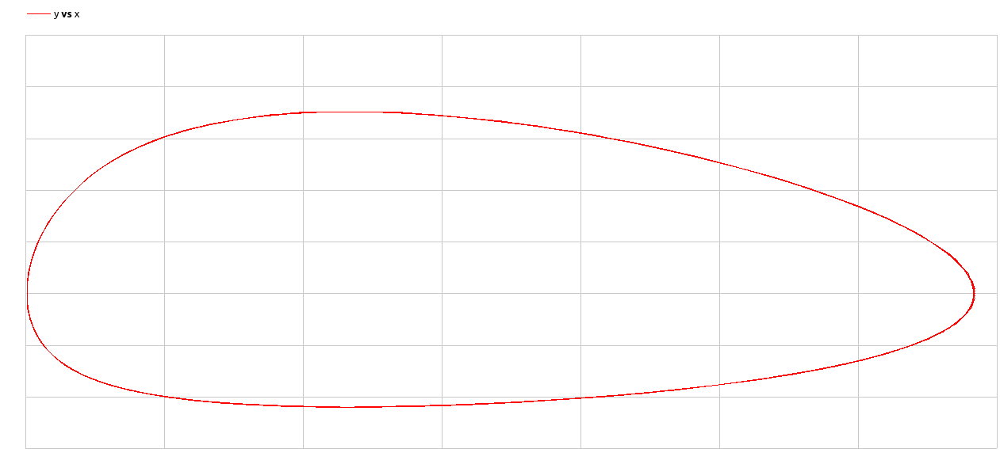

---
## Front matter
title: "Лабораторная работа 6"
##subtitle: "Простейший вариант"
author: "Тагиев Байрам Алтай оглы"

## Generic otions
lang: ru-RU
toc-title: "Содержание"

## Bibliography
bibliography: bib/cite.bib
csl: pandoc/csl/gost-r-7-0-5-2008-numeric.csl

## Pdf output format
toc: true # Table of contents
toc-depth: 2
lof: true # List of figures
lot: true # List of tables
fontsize: 12pt
linestretch: 1.5
papersize: a4
documentclass: scrreprt
## I18n polyglossia
polyglossia-lang:
  name: russian
  options:
	- spelling=modern
	- babelshorthands=true
polyglossia-otherlangs:
  name: english
## I18n babel
babel-lang: russian
babel-otherlangs: english
## Fonts
mainfont: DejaVu Serif
romanfont: DejaVu Serif
sansfont: DejaVu Sans
monofont: DejaVu Sans Mono
mainfontoptions: Ligatures=TeX
romanfontoptions: Ligatures=TeX
sansfontoptions: Ligatures=TeX,Scale=MatchLowercase
monofontoptions: Scale=MatchLowercase,Scale=0.9
## Pandoc-crossref LaTeX customization
figureTitle: "Рис."
tableTitle: "Таблица"
listingTitle: "Листинг"
lofTitle: "Список иллюстраций"
lotTitle: "Список таблиц"
lolTitle: "Листинги"
## Misc options
indent: true
header-includes:
  - \usepackage{indentfirst}
  - \usepackage{float} # keep figures where there are in the text
  - \floatplacement{figure}{H} # keep figures where there are in the text 
  - \usepackage{pdflscape}
  - \newcommand{\blandscape}{\begin{landscape}}
  - \newcommand{\elandscape}{\end{landscape}}
  - \usepackage{caption}
  - \captionsetup[figure]{
      name=,
      labelsep=none,
      labelformat=empty
    }
---

# Цель работы

Целью данной работы является построение модели хищник-жертва.

# Теоретическое введение

Модель Лотки—Вольтерры (@wiki:lv_eq) — модель взаимодействия двух видов типа «хищник — жертва», названная в честь её авторов, которые предложили модельные уравнения независимо друг от друга. Такие уравнения можно использовать для моделирования систем «хищник — жертва», «паразит — хозяин», конкуренции и других видов взаимодействия между двумя видами.

Данная двувидовая модель основывается на следующих предположениях:

1. Численность популяции жертв x и хищников y зависят только от времени (модель не учитывает пространственное распределение популяции на занимаемой территории)

2. В отсутствии взаимодействия численность видов изменяется по модели Мальтуса, при этом число жертв увеличивается, а число хищников падает

3. Естественная смертность жертвы и естественная рождаемость хищника считаются несущественными

4. Эффект насыщения численности обеих популяций не учитывается

5. Скорость роста численности жертв уменьшается пропорционально численности хищников

# Выполнение лабораторной работы

1. Реализуем модель на xcos. Добавим необходимые блоки.

{width=60%}

2. Зададим начальные условия на блоках интегрирования.

{width=70%}

{width=70%}

3. Запустив, мы увидим два графика.

{width=70%}

{width=70%}

4. Перейдем к реализации с блоком modelica. Сдеалаем следующую схему.

{width=70%}

5. Добавим "исходный код в наш блок".

{width=70%}

6. Запустив получим аналогичные графики, как и в 3 пунтке.

7. Перейдем к OpenModelica. Далее представлен листинг программы.

```modelica
model m1
parameter Real a=2,b=1,c=0.3,d=1;
Real x(start=2), y(start=1);
equation
der(x)=a*x-b*x*y;
der(y)=c*x*y-d*y;
annotation(
    experiment(StartTime = 0, StopTime = 30, Tolerance = 1e-6, Interval = 0.06));
end m1;
```

8. Запустив, получим следующие графики.

{width=70%}

{width=70%}


# Выводы

Мы реализовали модель "Хищник-жертва" в xcos, modelica и OpenModelica.


