---
## Front matter
lang: ru-RU
title: "Упражнение: Фигуры Лиссажу"
## subtitle: Простейший шаблон
author:
  - Тагиев Б. А.
institute:
  - Российский университет дружбы народов, Москва, Россия
date: 12 апреля 2023

## i18n babel
babel-lang: russian
babel-otherlangs: english

## Formatting pdf
toc: false
toc-title: Содержание
figureTitle: "Рис."
slide_level: 2
aspectratio: 169
section-titles: true
theme: metropolis
mainfont: DejaVu Serif
romanfont: DejaVu Serif
sansfont: DejaVu Sans
monofont: DejaVu Sans Mono
header-includes:
 - \metroset{progressbar=frametitle,sectionpage=progressbar,numbering=fraction}
 - '\makeatletter'
 - '\beamer@ignorenonframefalse'
 - '\makeatother'
---

## Цель работы

Построить с помощью xcos фигуры Лиссажу с различными значениями параметров.

## Выполнение лабораторной работы

1. Построим небольшую блок-схему на xcos.

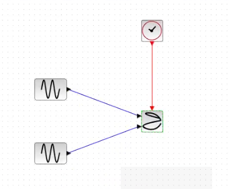{width=50%}

## Упражнение 1

Постройте с помощью xcos фигуры Лиссажу со следующими параметрами:

- A = B = 1, a = 2, b = 2, δ = 0; π/4; π/2; 3π/4; π;

## Упражнение 1

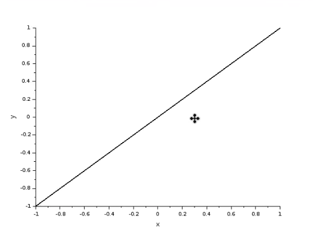{width=50%}

## Упражнение 1

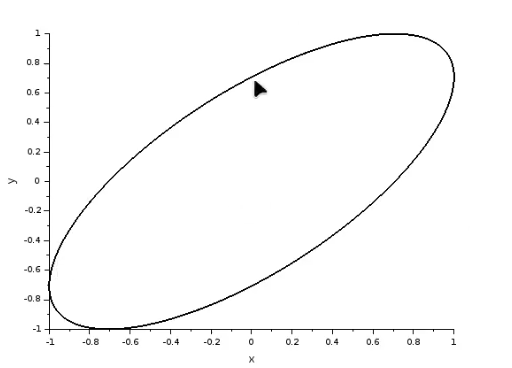{width=50%}

## Упражнение 1

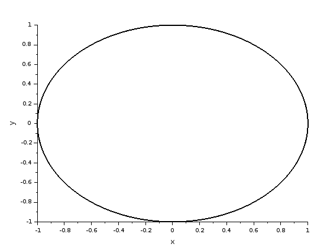{width=50%}

## Упражнение 1

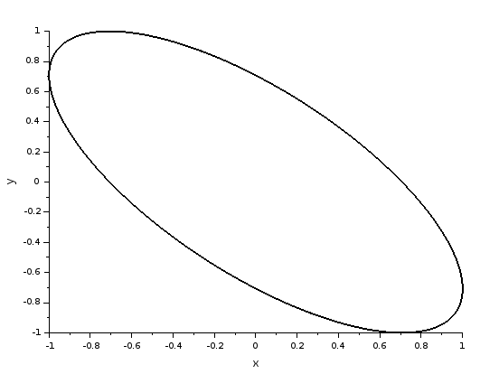{width=50%}

## Упражнение 1

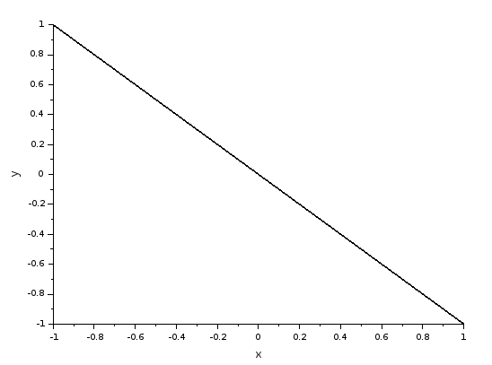{width=50%}

## Упражнение 2

Постройте с помощью xcos фигуры Лиссажу со следующими параметрами:

- A = B = 1, a = 2, b = 4, δ = 0; π/4; π/2; 3π/4; π;

## Упражнение 2

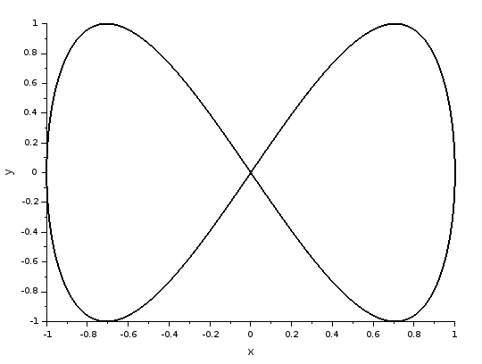{width=50%}

## Упражнение 2

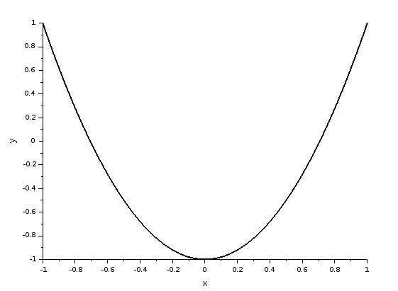{width=50%}

## Упражнение 2

{width=50%}

## Упражнение 2

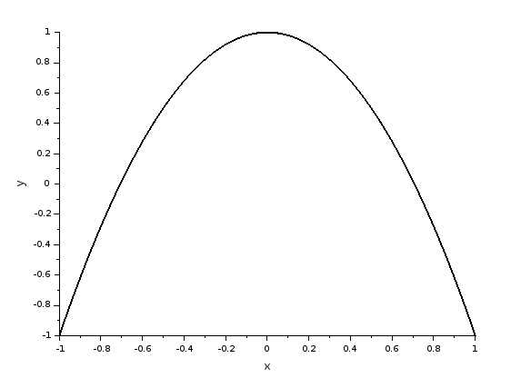{width=50%}

## Упражнение 2

{width=50%}

## Упражнение 3

Постройте с помощью xcos фигуры Лиссажу со следующими параметрами:

- A = B = 1, a = 2, b = 6, δ = 0; π/4; π/2; 3π/4; π;

## Упражнение 3

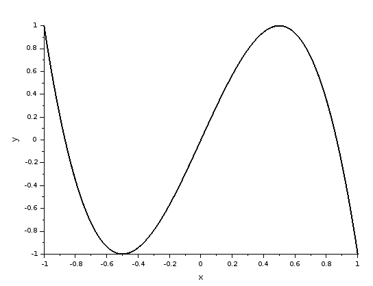{width=50%}

## Упражнение 3

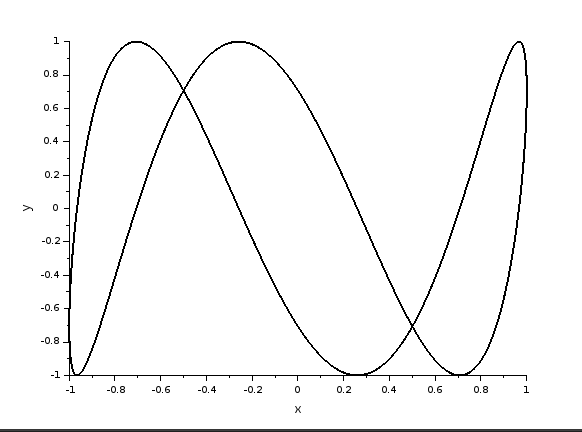{width=50%}

## Упражнение 3

{width=50%}

## Упражнение 3

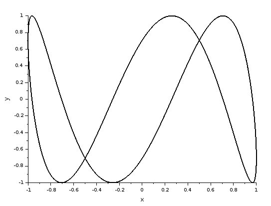{width=50%}

## Упражнение 3

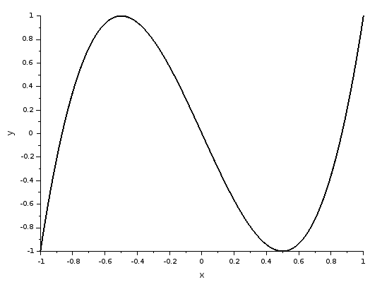{width=50%}

## Упражнение 4

Постройте с помощью xcos фигуры Лиссажу со следующими параметрами:

- A = B = 1, a = 2, b = 3, δ = 0; π/4; π/2; 3π/4; π.

## Упражнение 4

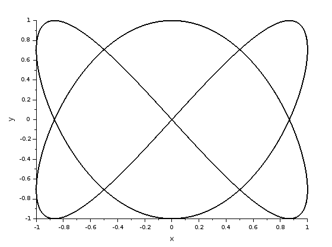{width=50%}

## Упражнение 4

{width=50%}

## Упражнение 4

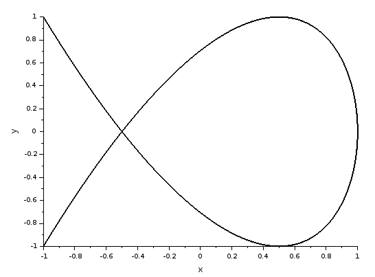{width=50%}

## Упражнение 4

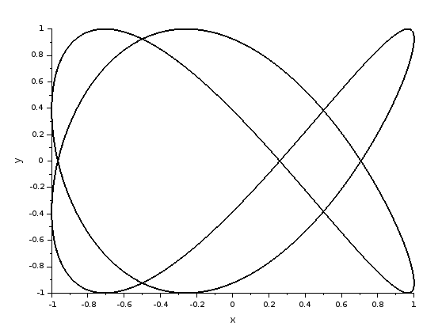{width=50%}

## Упражнение 4

{width=50%}

## Выводы

По мере выполнения данной работы я построил фигуры Лиссажу на xcos.

