---
## Front matter
title: "Упражнение: Фигуры Лиссажу"
##subtitle: "Простейший вариант"
author: "Тагиев Байрам Алтай оглы"

## Generic otions
lang: ru-RU
toc-title: "Содержание"

## Bibliography
bibliography: bib/cite.bib
csl: pandoc/csl/gost-r-7-0-5-2008-numeric.csl

## Pdf output format
toc: true # Table of contents
toc-depth: 2
lof: true # List of figures
lot: true # List of tables
fontsize: 12pt
linestretch: 1.5
papersize: a4
documentclass: scrreprt
## I18n polyglossia
polyglossia-lang:
  name: russian
  options:
	- spelling=modern
	- babelshorthands=true
polyglossia-otherlangs:
  name: english
## I18n babel
babel-lang: russian
babel-otherlangs: english
## Fonts
mainfont: DejaVu Serif
romanfont: DejaVu Serif
sansfont: DejaVu Sans
monofont: DejaVu Sans Mono
mainfontoptions: Ligatures=TeX
romanfontoptions: Ligatures=TeX
sansfontoptions: Ligatures=TeX,Scale=MatchLowercase
monofontoptions: Scale=MatchLowercase,Scale=0.9
## Pandoc-crossref LaTeX customization
figureTitle: "Рис."
tableTitle: "Таблица"
listingTitle: "Листинг"
lofTitle: "Список иллюстраций"
lotTitle: "Список таблиц"
lolTitle: "Листинги"
## Misc options
indent: true
header-includes:
  - \usepackage{indentfirst}
  - \usepackage{float} # keep figures where there are in the text
  - \floatplacement{figure}{H} # keep figures where there are in the text 
  - \usepackage{pdflscape}
  - \newcommand{\blandscape}{\begin{landscape}}
  - \newcommand{\elandscape}{\end{landscape}}
  - \usepackage{caption}
  - \captionsetup[figure]{
      name=,
      labelsep=none,
      labelformat=empty
    }
---

# Цель работы

Построить с помощью xcos фигуры Лиссажу с различными значениями параметров.

# Выполнение лабораторной работы

1. Построим небольшую блок-схему на xcos.

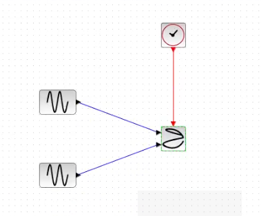{}

## Упражнение 1

Постройте с помощью xcos фигуры Лиссажу со следующими параметрами:

- A = B = 1, a = 2, b = 2, δ = 0; π/4; π/2; 3π/4; π;

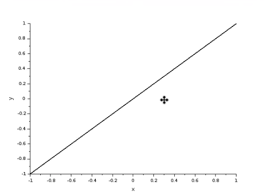{}

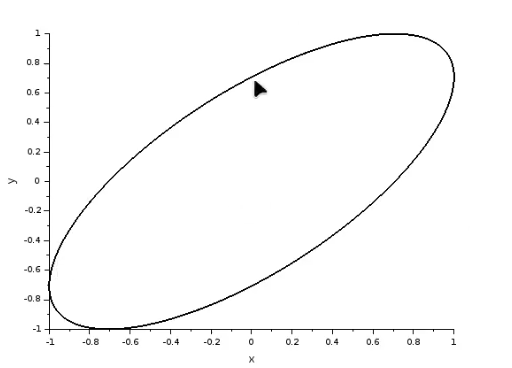{}

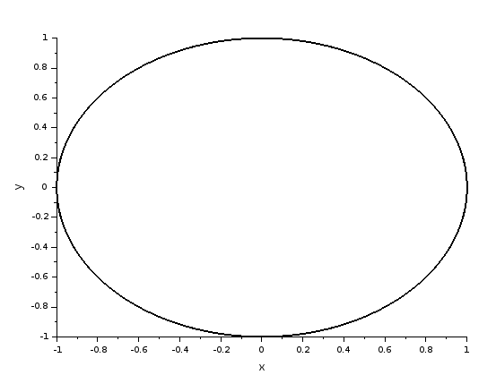{}

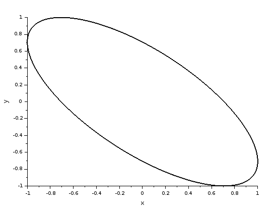{}

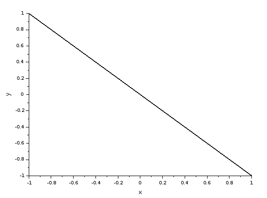{}

## Упражнение 2

Постройте с помощью xcos фигуры Лиссажу со следующими параметрами:

- A = B = 1, a = 2, b = 4, δ = 0; π/4; π/2; 3π/4; π;

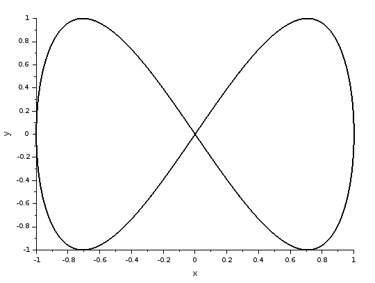{}

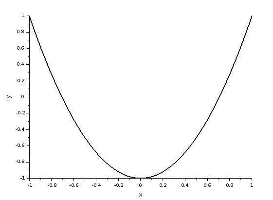{}

{}

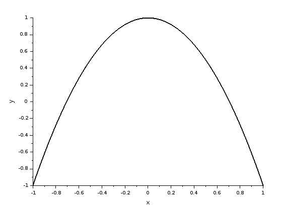{}

{}

## Упражнение 3

Постройте с помощью xcos фигуры Лиссажу со следующими параметрами:

- A = B = 1, a = 2, b = 6, δ = 0; π/4; π/2; 3π/4; π;

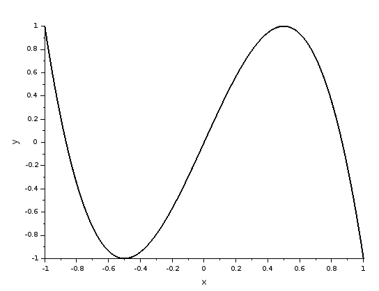{}

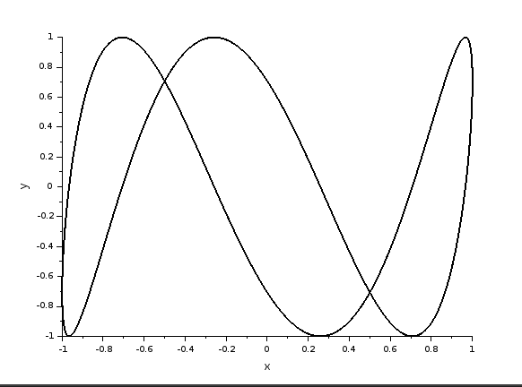{}

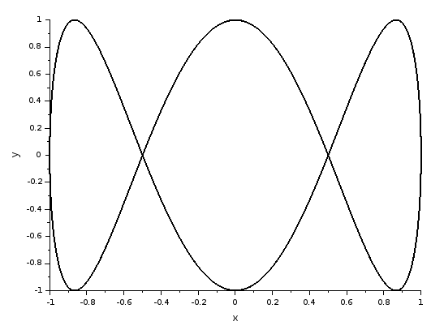{}

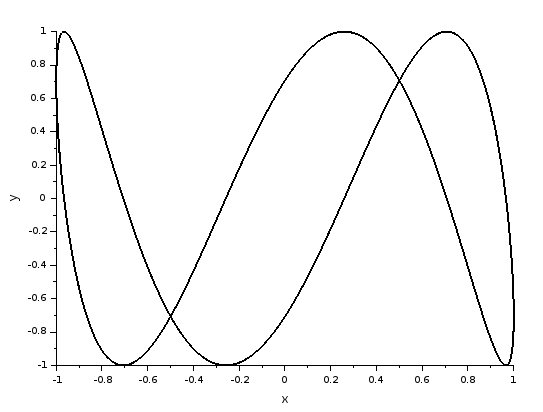{}

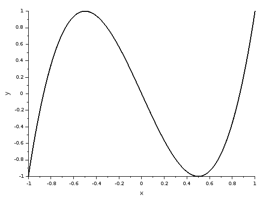{}

## Упражнение 4

Постройте с помощью xcos фигуры Лиссажу со следующими параметрами:

- A = B = 1, a = 2, b = 3, δ = 0; π/4; π/2; 3π/4; π.

{}

{}

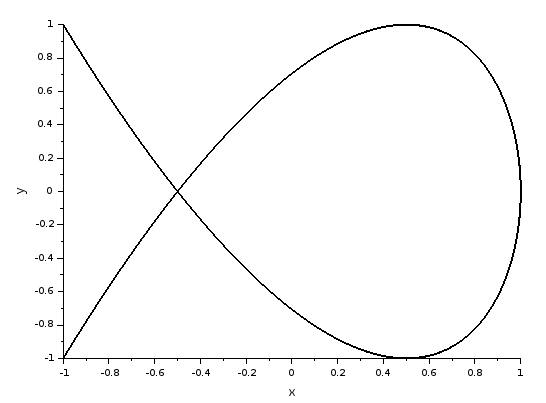{}

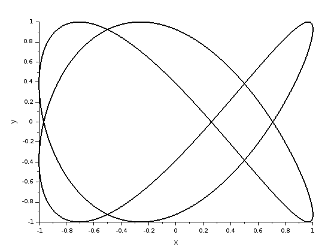{}

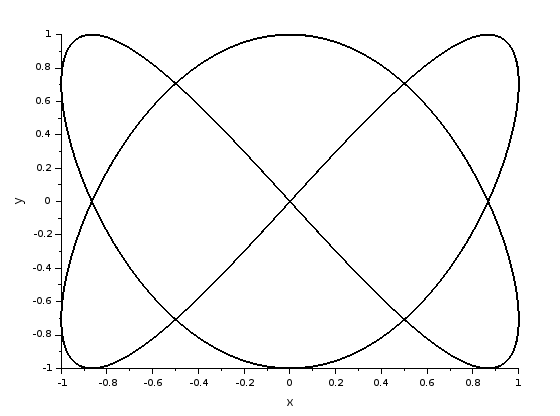{}

# Выводы

По мере выполнения данной работы я построил фигуры Лиссажу на xcos.

