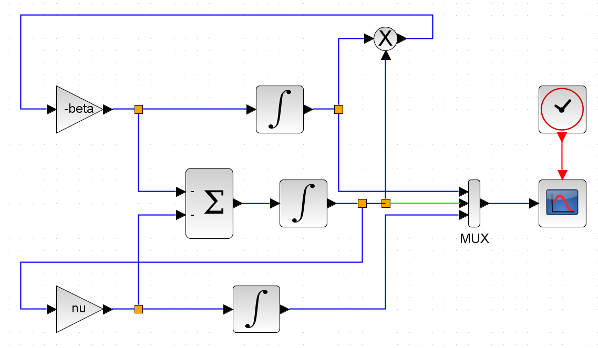
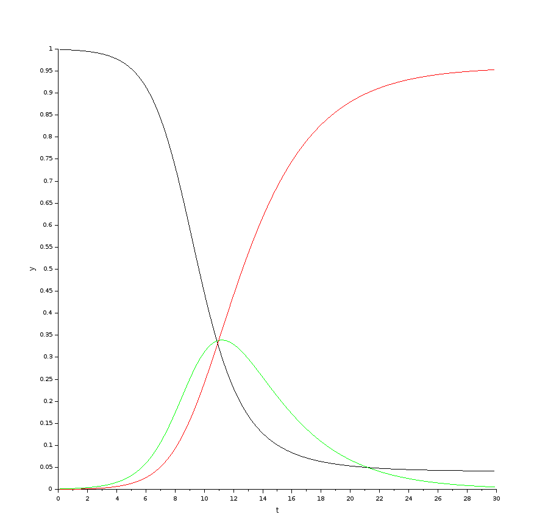
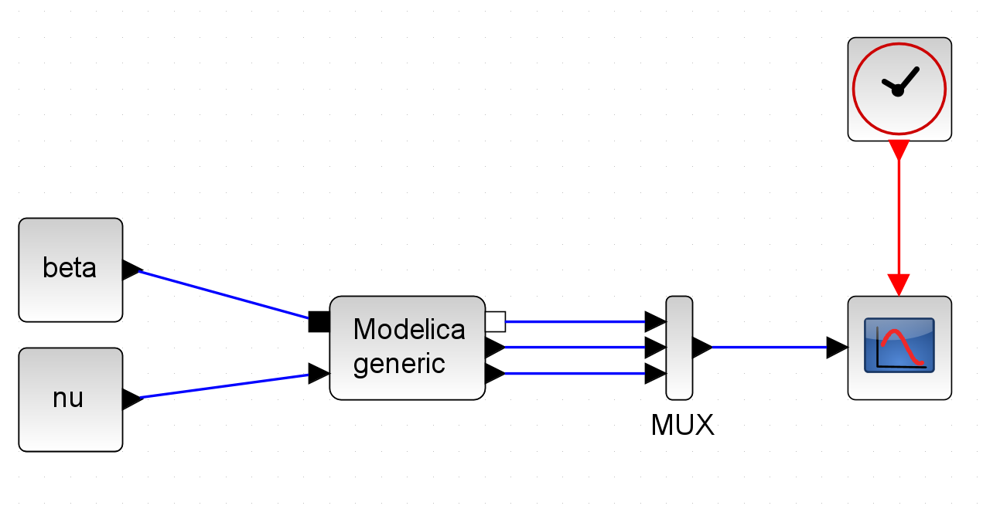
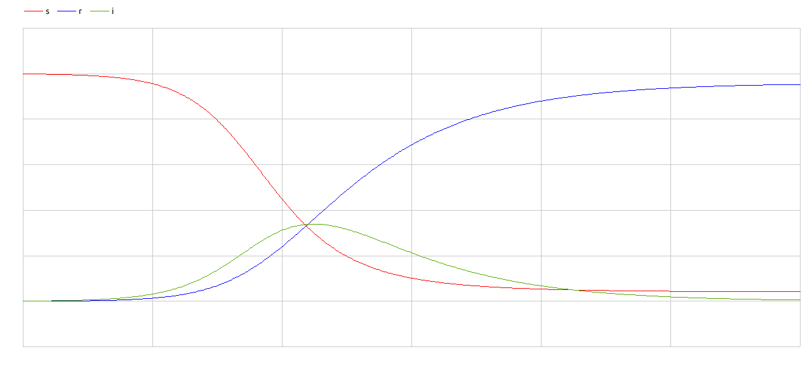
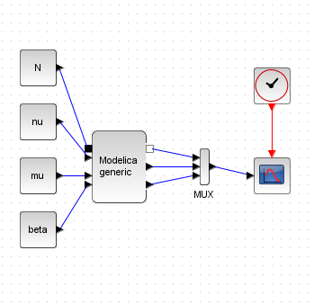
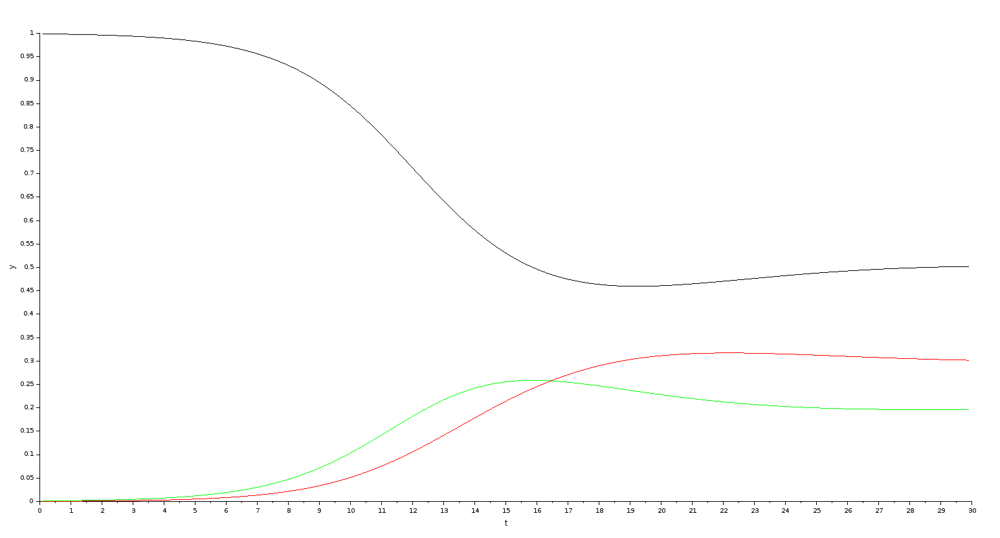
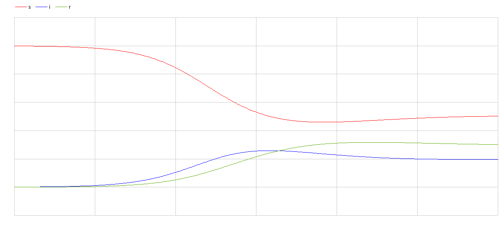

---
## Front matter
lang: ru-RU
title: Лабораторная работа 5
## subtitle: Простейший шаблон
author:
  - Тагиев Б. А.
institute:
  - Российский университет дружбы народов, Москва, Россия
date: 13 апреля 2023

## i18n babel
babel-lang: russian
babel-otherlangs: english

## Formatting pdf
toc: false
toc-title: Содержание
figureTitle: "Рис."
slide_level: 2
aspectratio: 169
section-titles: true
theme: metropolis
mainfont: DejaVu Serif
romanfont: DejaVu Serif
sansfont: DejaVu Sans
monofont: DejaVu Sans Mono
header-includes:
 - \metroset{progressbar=frametitle,sectionpage=progressbar,numbering=fraction}
 - '\makeatletter'
 - '\beamer@ignorenonframefalse'
 - '\makeatother'
---
## Цель работы

Целью данной работы является построение модели эпидемии.

## Выполнение лабораторной работы

1. Зададим переменные окружения. `beta=1,nu=.3`

## Выполнение лабораторной работы

2. Сделаем блок-схему для моделирования.

{width=60%}

## Выполнение лабораторной работы

3. Запустив, получим следующий график.

{width=50%}

## Выполнение лабораторной работы

4. Дальше сделаем аналогичную схему на xcos с применением modelica. Для этого сделаем следующую схему.

{width=60%}

## Выполнение лабораторной работы

5. Запустив, получим аналогичный график как в пункте 3.

6. Перейдем к реализации на OpenModelica. 

## Выполнение лабораторной работы

```modelica
model lab5
  Real beta = 1, nu = 0.3;
  Real s(start = .999);
  Real i(start = .001);
  Real r(start = .0);
equation
  der(s) = -beta*s*i;
  der(i) = beta*s*i - nu*i;
  der(r) = nu*i;
  annotation(
    experiment(StartTime = 0, StopTime = 30, Tolerance = 1e-06, Interval = 0.06));
end lab5;
```

## Выполнение лабораторной работы

{width=50%}

## Задание для самостоятельного выполнения

1. xcos + modelica

{width=50%}

## Задание для самостоятельного выполнения

```modelica
class generic
      Real beta,nu,mu,N;
      Real s(start=.999), i(start=.001), r(start=.0);
equation
     der(s) = -beta*s*i + mu*N - s*mu;
     der(i) = beta*s*i - nu*i - mu*i;
     der(r) = nu*i - mu*r;
end generic;
```

## Задание для самостоятельного выполнения

{width=50%}

## Задание для самостоятельного выполнения

2. OpenModelica

{width=50%}

## Задание для самостоятельного выполнения

```modelica
model lab5
  Real beta = 1, nu = 0.3, mu = 0.2, N = 1;
  Real s(start = .999);
  Real i(start = .001);
  Real r(start = .0);
equation
  der(s) = -beta*s*i + mu*N - s*mu;
  der(i) = beta*s*i - nu*i - mu*i;
  der(r) = nu*i - mu*r;
end lab5;
```

## Выводы

Мы реализовали модель "Хищник-жертва" в xcos, modelica и OpenModelica.


