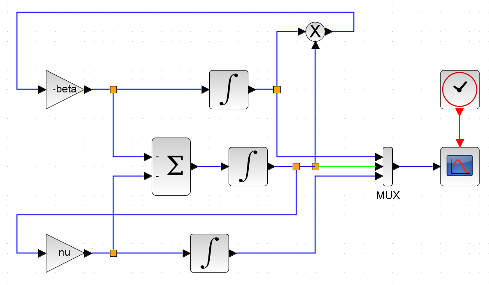
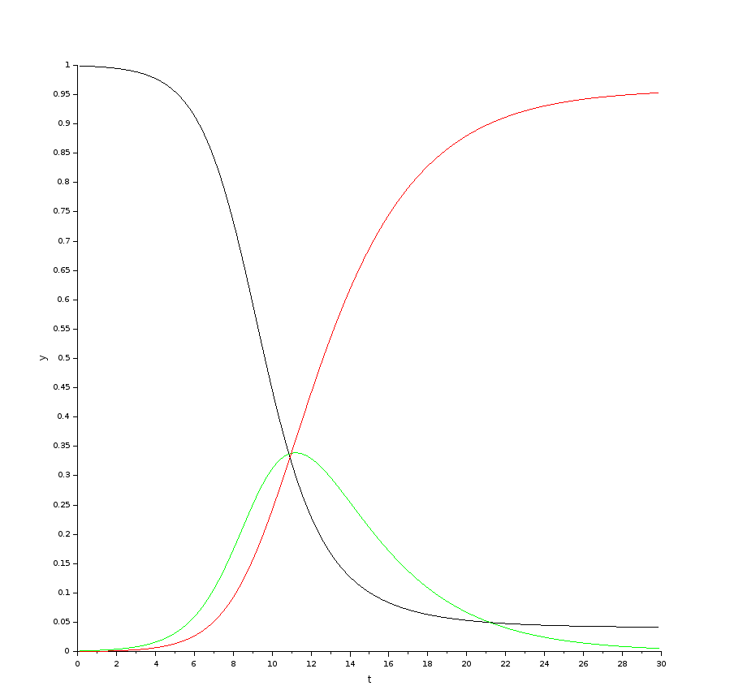
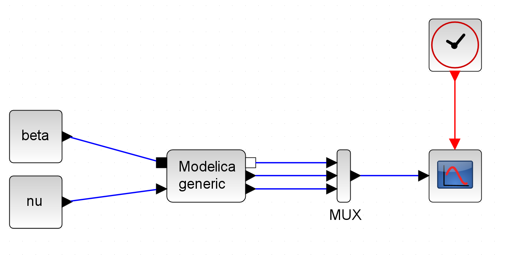
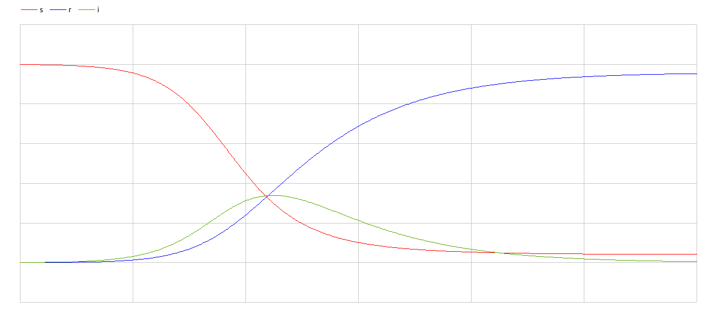
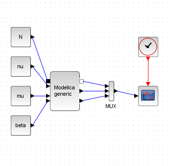
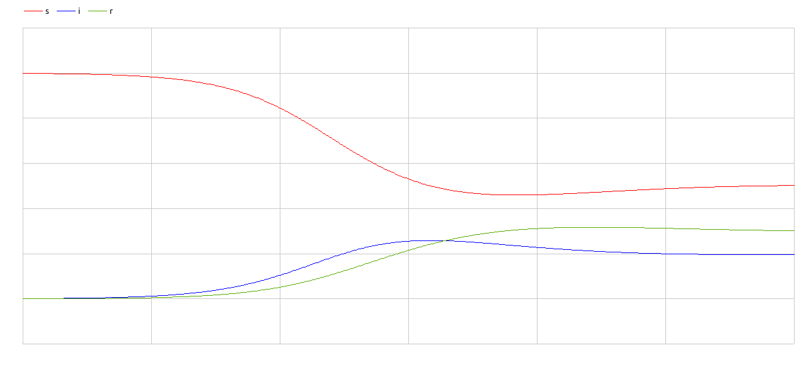

---
## Front matter
title: "Лабораторная работа 5"
##subtitle: "Простейший вариант"
author: "Тагиев Байрам Алтай оглы"

## Generic otions
lang: ru-RU
toc-title: "Содержание"

## Bibliography
bibliography: bib/cite.bib
csl: pandoc/csl/gost-r-7-0-5-2008-numeric.csl

## Pdf output format
toc: true # Table of contents
toc-depth: 2
lof: true # List of figures
lot: true # List of tables
fontsize: 12pt
linestretch: 1.5
papersize: a4
documentclass: scrreprt
## I18n polyglossia
polyglossia-lang:
  name: russian
  options:
	- spelling=modern
	- babelshorthands=true
polyglossia-otherlangs:
  name: english
## I18n babel
babel-lang: russian
babel-otherlangs: english
## Fonts
mainfont: DejaVu Serif
romanfont: DejaVu Serif
sansfont: DejaVu Sans
monofont: DejaVu Sans Mono
mainfontoptions: Ligatures=TeX
romanfontoptions: Ligatures=TeX
sansfontoptions: Ligatures=TeX,Scale=MatchLowercase
monofontoptions: Scale=MatchLowercase,Scale=0.9
## Pandoc-crossref LaTeX customization
figureTitle: "Рис."
tableTitle: "Таблица"
listingTitle: "Листинг"
lofTitle: "Список иллюстраций"
lotTitle: "Список таблиц"
lolTitle: "Листинги"
## Misc options
indent: true
header-includes:
  - \usepackage{indentfirst}
  - \usepackage{float} # keep figures where there are in the text
  - \floatplacement{figure}{H} # keep figures where there are in the text 
  - \usepackage{pdflscape}
  - \newcommand{\blandscape}{\begin{landscape}}
  - \newcommand{\elandscape}{\end{landscape}}
  - \usepackage{caption}
  - \captionsetup[figure]{
      name=,
      labelsep=none,
      labelformat=empty
    }
---

# Цель работы

Целью данной работы является построение модели эпидемии.

# Выполнение лабораторной работы

1. Зададим переменные окружения. `beta=1,nu=.3`

2. Сделаем блок-схему для моделирования.

{width=60%}

3. Запустив, получим следующий график.

{width=50%}

4. Дальше сделаем аналогичную схему на xcos с применением modelica. Для этого сделаем следующую схему.

{width=60%}

5. Запустив, получим аналогичный график как в пункте 3.

6. Перейдем к реализации на OpenModelica. 

```modelica
model lab5
  Real beta = 1, nu = 0.3;
  Real s(start = .999);
  Real i(start = .001);
  Real r(start = .0);
equation
  der(s) = -beta*s*i;
  der(i) = beta*s*i - nu*i;
  der(r) = nu*i;
  annotation(
    experiment(StartTime = 0, StopTime = 30, Tolerance = 1e-06, Interval = 0.06));
end lab5;
```

{width=50%}

## Задание для самостоятельного выполнения

1. xcos + modelica

{width=50%}

```modelica
class generic
      Real beta,nu,mu,N;
      Real s(start=.999), i(start=.001), r(start=.0);
equation
     der(s) = -beta*s*i + mu*N - s*mu;
     der(i) = beta*s*i - nu*i - mu*i;
     der(r) = nu*i - mu*r;
end generic;
```

{width=50%}

2. OpenModelica

```modelica
model lab5
  Real beta = 1, nu = 0.3, mu = 0.2, N = 1;
  Real s(start = .999);
  Real i(start = .001);
  Real r(start = .0);
equation
  der(s) = -beta*s*i + mu*N - s*mu;
  der(i) = beta*s*i - nu*i - mu*i;
  der(r) = nu*i - mu*r;
end lab5;
```

{width=50%}


# Выводы

Мы реализовали модель "Хищник-жертва" в xcos, modelica и OpenModelica.


